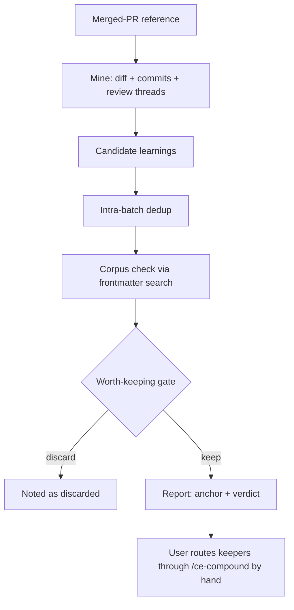

# Batch Learning Capture — `ce-learning-sweep` Requirements

## Summary

Add `ce-learning-sweep`, a report-only skill that sweeps one merged PR — diff, commit messages, review threads — for candidate learnings, dedups them within the batch, checks each against the `docs/solutions/` corpus, and reports survivors with a confidence anchor and a three-way corpus verdict. It writes nothing; keepers are routed through `/ce-compound` by hand. This is the MVP probe for full batch capture (opportunity B0), validated against a pre-committed five-PR experiment before any write automation is built.

---

## Problem Frame

`ce-compound` captures one learning at a time, and only when a human remembers to invoke it. The dynamic-workflows opportunity map names this the capture bottleneck and makes batch capture the Track B lead (B0): more captured learnings feed the Learnings-reuse metric directly. The map left one question open (its R8): what triggers a batch sweep, and how write-time dedup should work.

Two honesty obligations shape this brainstorm. First, the bottleneck claim is an **inference, not an observed fact** — when probed for a concrete miss, the strongest pain on record was a different problem (losing the execution thread across `ce-work` runs on multi-phase plans), which is routed to its own follow-up. Second, this program already paid for running conversions before defining their signal (the lesson recorded in `docs/adr/0001-per-metric-signal-gate.md`). Both obligations point the same way: build the cheapest version that can genuinely test the bottleneck claim, and fix the pass/fail bar before the first run.

---

## Key Decisions

- **Report-only MVP before any automation.** A sweep that only reports cannot violate the loose-coupling constraint (opportunity map R14), needs no workflow conversion, and is exactly enough to run the five-PR experiment. Write automation is earned by the experiment, not assumed.
- **Net-new sibling skill `ce-learning-sweep`, not a fourth `ce-compound` mode.** `ce-compound` is already large with three modes, and a never-writes mode inside a skill whose contract is writing would blur both. `ce-compound` remains the sole write seam; the sweep is a generate-and-filter front-end.
- **Three-way verdict, with the extend flag surviving v1.** The verdict is new / already-documented / overlaps-existing-doc. The extend *action* is v2, but the flag costs nothing in a report and collapsing it into either neighbor corrupts the precision measurement and buries the v2 case for extend-capable dedup.
- **Pre-committed success bar.** The experiment's numbers are fixed in this doc before the first run, so "did it pass?" is never relitigated after seeing output.
- **Per-PR primary trigger** (resolving the map's open R8 question): replayable and platform-neutral — a PR reference is a stable, re-runnable input on any forge. A manual session sweep is the v2 secondary mode.
- **Intra-batch dedup is the genuinely new dedup work.** Per-learning extend-not-skip already exists: `ce-compound`'s write path updates an existing doc in place on high overlap. What no mechanism handles today is two candidates from the same PR that are really one learning.

---

## Requirements

**Sweep behavior**

- R1. `ce-learning-sweep` accepts a single merged-PR reference and mines three inputs: the PR diff, its commit messages, and its review threads.
- R2. Invocation is manual and replayable — the same PR reference can be swept again with no hook, automation, or forge-specific trigger required.
- R3. When review threads are unavailable (no forge access, or a PR with no threads), the shipped skill degrades to diff + commit messages and the report states that it ran on degraded inputs.

**Candidates, dedup, and verdicts**

- R4. Candidates are deduped within the batch before any corpus check — multiple candidates describing the same underlying learning merge into one.
- R5. Each candidate is checked against the existing `docs/solutions/` corpus via frontmatter search (`module`, `tags`, `problem_type`).
- R6. A confidence-anchored worth-keeping gate filters candidates, biased toward precision — the expectation is ~0–1 keepers per typical PR. Every reported candidate carries its anchor level.
- R7. Each reported candidate carries a three-way corpus verdict: `new`, `already-documented`, or `overlaps-existing` (naming the overlapping doc and flagging it as an extend candidate). The verdict is never collapsed to two values.

**Report contract**

- R8. The skill is report-only: it writes nothing to the repo. Capture writes happen only through `/ce-compound`, invoked by hand — loose-coupling compliance by construction.
- R9. The report presents each keeper with its anchor level, verdict, and an evidence pointer into the PR, in a form the user can route directly into a `/ce-compound` invocation.
- R10. A sweep that yields nothing produces a clean "no candidates" report — including against an empty corpus, where the sweep must run cleanly and verdict everything `new`.

---

## Key Flows

- F1. Sweep run
  - **Trigger:** User invokes `ce-learning-sweep` with a merged-PR reference.
  - **Steps:** Mine the three inputs; extract candidate learnings; merge intra-batch duplicates; check each against `docs/solutions/` frontmatter; apply the worth-keeping gate; emit the report.
  - **Outcome:** A report of keepers (anchor + verdict + evidence pointer) and discards. Nothing written.
  - **Covers:** R1–R7, R10.
- F2. Manual routing
  - **Trigger:** User picks a keeper from the report.
  - **Steps:** User invokes `/ce-compound` for that learning; `ce-compound`'s own overlap handling decides create vs update-in-place, including for `overlaps-existing` keepers.
  - **Outcome:** The learning lands in `docs/solutions/` through the existing write+dedup seam.
  - **Covers:** R8, R9.

---

## Acceptance Examples

- AE1. **Covers R3.** Given a PR whose review threads are inaccessible, when swept in normal (non-experiment) use, the report is built from diff + commits and explicitly states the degraded inputs.
- AE2. **Covers R4.** Given a PR where the diff and a review thread each surface the same underlying gotcha, the two candidates merge into one before the corpus check.
- AE3. **Covers R7.** Given a candidate partially covered by an existing solution doc, the verdict is `overlaps-existing` with the doc named and the extend-candidate flag set — neither `new` nor `already-documented`.
- AE4. **Covers R5, R10.** Given an empty `docs/solutions/` directory, the sweep completes cleanly and every gated-in candidate is verdicted `new`.
- AE5. **Covers R6, R10.** Given a PR containing no durable learnings (e.g., a records-only test PR), the sweep reports zero candidates as a correct, clean outcome.

---

## Success Criteria

The validation experiment: sweep five recent merged PRs, including PR #13 and PR #14. **The bar below is pre-committed — fixed here before the first run.**

- **Yield:** at least 2 keep-worthy, never-captured candidates across the five PRs.
- **Precision:** noise no worse than ~1 discarded candidate per keeper — the report must read as signal, not a list to triage.
- **Corpus accuracy:** already-documented ground is correctly marked as such, never re-proposed as new.

Protocol conditions for the runs to count:

- **Forge access required.** All five experiment runs execute with review threads available. The diff+commits degrade path (R3) is shipped-skill behavior only; a degraded run does not count toward the experiment — it would test the weaker "does a diff contain learnings" claim while appearing to test B0.
- **Known-answer probe:** PR #13 contains a ground-truth uncaptured learning — the fixture-telemetry disposition decision (verified absent from `docs/solutions/` as of 2026-06-09). A sweep that misses it is missing real signal.
- **Negative control:** PR #14 is a comment-only trial record; zero yield on it is the correct output, not a result that counts against the bet.

**Falsification clause:** zero keep-worthy yield across all five PRs falsifies the capture-bottleneck claim for this corpus and deprioritizes full B0 — the experiment is designed to be able to fail.

---

## Scope Boundaries

**Deferred to v2 (gated on the experiment passing)**

- Auto-routing survivors through `ce-compound` headless (the gate becomes a front-end to the write seam rather than a report).
- The workflow fan-out conversion — Claude-Code-only, with a prose fallback guard on other targets (opportunity map R15).
- The manual session sweep as an explicit secondary mode.
- The completed plan doc as a fourth sweep input.
- Acting on extend flags (extend-capable dedup at write time).

**Deferred further (v3 idea, recorded only)**

- Marker-assisted capture: producer skills (`ce-work`, `ce-debug`, `ce-commit-push-pr`) emit candidate markers at solve time and the sweep collects them. Rejected for v1 — it touches every producer skill against the loose-coupling spirit, and it cannot run retroactively, so it cannot power the experiment.

**Not this feature**

- The `ce-work` progress-thread problem — losing execution state across runs on multi-phase plans. Real, concretely observed, and a different candidate; it gets its own follow-up brainstorm.

---

## Dependencies / Assumptions

- **Assumption (load-bearing, recorded honestly):** the capture bottleneck is an inference. The evidence probe surfaced concrete pain elsewhere (progress-thread continuity), not a remembered missed learning. The five-PR experiment is the test of this assumption.
- **Assumption:** frontmatter search is adequate corpus-checking at the current corpus size (31 docs). High-recall retrieval is a separate, timing-gated candidate (the map's B2) and is not built here.
- **Dependency:** `ce-compound`'s write path already updates an existing doc in place on high overlap, so manual routing of `overlaps-existing` keepers is extend-capable today with no new write machinery.
- **Dependency:** forge CLI access (e.g., `gh`) for review threads — required for the experiment runs, optional for shipped use (R3).
- **Ground truth for the experiment:** PR #13 carries the uncaptured fixture-telemetry disposition decision; PR #14 is a comment-only trial record.

---

## Outstanding Questions

**Deferred to planning**

- Report format and structure (sections, how discards are listed — in full or as a count).
- The anchor-level scale (how many confidence levels, and their definitions).
- How the report phrases the per-keeper `/ce-compound` handoff.

---

## Sources / Research

- `docs/dynamic-workflows-opportunity-map.md` — the B0 row (§5.1), Track B ordering (§6), the loose-coupling and R15 constraints (§7), and the open R8 trigger question (§8) that this doc resolves with the per-PR trigger.
- `docs/adr/0001-per-metric-signal-gate.md` — the pre-commitment discipline the success bar follows.
- `plugins/compound-engineering/skills/ce-compound/SKILL.md` — the Phase 2 overlap table proving per-learning extend-not-skip already exists; intra-batch dedup is the genuinely new work.
- `STRATEGY.md` — the Learnings-reuse metric this candidate serves.
- `docs/plans/2026-06-08-001-feat-drift-capture-loop-plan.md` — precedent for capture-side artifacts and the report-primary discipline.
