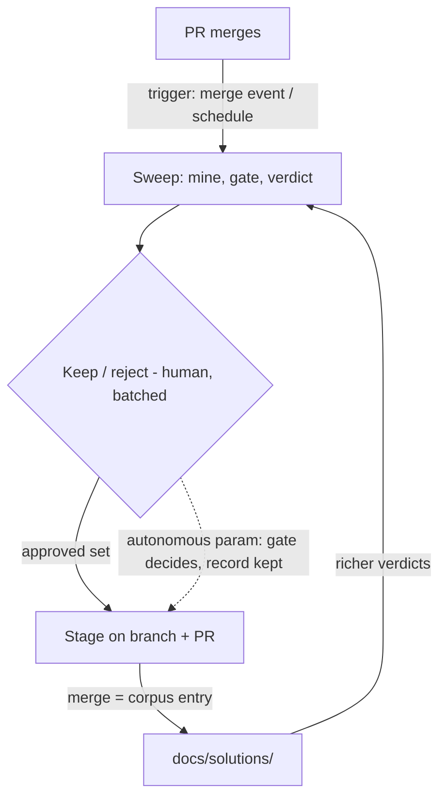

# The Loop System and Capture-Loop Closure — Requirements

## Summary

Name the loop system as the plugin's operating goal — the developer authors loops, the system runs them, the human holds the irreversible-commit gates — and ship its first full instance: close the learning-capture loop's trigger and write edges (automated sweeps, one batched human keep/reject moment, mechanical capture execution, autonomy by explicit parameter), and close the drift loop's read edge (aggregation over drift events).

---

## Problem Frame

The plugin's compounding workflows already form loops, but the human is each loop's executor, not its author. The capture loop's v1 (`ce-learning-sweep`) proved its judgment quality — the pre-committed five-PR experiment passed on yield, precision, and corpus accuracy (recorded in `tests/learning-sweep-eval.test.ts`) — yet both of its remaining edges run on human effort: sweeps happen only when remembered, and routing the experiment's nine keepers through `/ce-compound` (commit `fea7add`) cost a per-keeper invocation and re-feeding context the sweep report already contained. The friction was execution, not deciding; the decisions themselves were fast.

The drift loop has the same half-closed shape from the other side: `ce-verify-work` now captures drift events durably, but nothing reads across them, so the telemetry accumulates without producing a signal.

The framing gap is that this edge-by-edge automation has no named system goal. The loops lens (Boris Cherny: "I don't prompt Claude anymore... My job is to write loops") names it: the developer's standing role should shrink to authoring loop definitions and adjudicating gates, while the system runs the cycles.

---

## Key Decisions

- **The loop-system goal.** The developer authors loops; the system runs them; the human holds the irreversible-commit gates — corpus entry in the capture loop, the ship call in the review loop. Default mode prompts the human at every judgment point; autonomy is a per-run, explicit opt-in. *(user-confirmed)*
- **Decision/execution split on the write edge.** The keep/reject call is human territory by default; everything around it — drafting entries, carrying context, performing approved writes — is the system's job. Grounded in observed evidence: hand-routing friction was re-invocation and context re-feeding, never the decision itself. *(user-confirmed)*
- **PR as the decision surface, with an in-session menu softening.** Inverting "approve, then write": captures are staged on a branch as proposed `docs/solutions/` entries and a PR carries them; merge is corpus entry. One surface serves interactive, triggered, and autonomous runs, and rides the repo's existing branch protection instead of new queue machinery. Manual runs may put a lightweight keep/reject menu in front of the same branch+PR machinery. *(user-selected over session-centric and loop-registry approaches)*
- **Edges graduate only through signal gates.** Manual → automatic requires a pre-committed ADR 0001 experiment. The capture loop's write and trigger edges earned theirs via the five-PR experiment PASS; autonomous corpus entry is a new edge and earns its own gate before it is ever recommended as a default.
- **Trigger and autonomy never combine silently.** Scheduled or merge-triggered sweeps default to a PR awaiting human review; pairing the automated trigger with autonomous merge requires deliberate configuration. *(user-confirmed)*
- **Loop-definition layer deferred by the rule of three.** No loop registry/runner until a third loop actually closes; the pattern must be proven by instances before it becomes an abstraction. *(user-confirmed)*
- **Machine-consumed handoff, not better prose.** v1's self-contained capture fuel still cost the human re-feeding; the keeper envelope must flow into `ce-compound` mechanically, with `ce-compound` remaining the sole write seam and authoritative at write time.

---

## Requirements

**Loop-system contract**

- R1. Every compounding workflow is described as a loop with named judgment points; in default mode the system prompts the human at each judgment point. The loop inventory and per-loop goals are mapped in `docs/brainstorms/2026-06-12-loop-system-map.html`.
- R2. An explicit autonomous parameter lets a run traverse its judgment points using the loop's pre-committed gate. Autonomy is opt-in per run or per explicit configuration — never inherited, and in particular never implied by an automated trigger. Autonomous runs leave a reviewable record of every decision the gate made.
- R3. An edge moves from manual to automatic only after passing a pre-committed signal gate (ADR 0001). The capture loop's trigger and write-execution edges have passed theirs (five-PR experiment, adjudicated PASS 2026-06-10).

**Capture loop — write edge**

- R4. A sweep run converges to exactly one batched keep/reject decision covering all keepers — never per-keeper invocations.
- R5. Approved keepers are captured through `ce-compound` mechanically: the keeper envelope flows from the sweep report into capture with no human re-supplying context. `ce-compound` stays the sole write seam and is authoritative at write time; sweep-vs-write verdict disagreements are recorded and surfaced, not silently resolved.
- R6. Captures are staged as a branch carrying proposed `docs/solutions/` entries with a PR as the decision surface; merging is what constitutes corpus entry. Default mode stops at PR-open. Staged writes are framed as proposals, not corpus entries.
- R7. Manual interactive runs may resolve keep/reject in an in-session menu in front of the same machinery: the menu decides, one branch+PR carries only the approved entries, and the merge is execution of the already-made decision.
- R8. A keep decision is re-validated against the current corpus at decision/merge time (extending v1's fresh-evaluation semantics), so approving a stale proposal can never land an already-documented entry.

**Capture loop — trigger edge**

- R9. Sweeps fire without being remembered — on merge or on a schedule covering merged PRs since the last sweep. Manual per-PR invocation remains available and unchanged.
- R10. Unattended (triggered) runs always default to stage-and-await-review; autonomous merge on a triggered run requires the explicit configuration pairing per R2.

**Drift loop — read edge**

- R11. An aggregation reads across `docs/drift-events/` and derives drift rates at read time — per plan and across plans — without storing any rate anywhere (ADR 0001). It is report-only: no judgment point, no writes, no autonomy parameter needed.
- R12. Low-confidence and degraded events are included and flagged in the aggregate, never silently dropped.

**Platform reach**

- R13. Loop machinery (automated triggers, any workflow fan-out) may be Claude-Code-only; on every other platform each loop retains a fully functional manual path — manual sweep, in-chat or PR decision, manual aggregation run.

---

## Key Flows

- F1. Manual sweep, in-session decision
  - **Trigger:** Developer invokes the sweep on a merged-PR reference.
  - **Steps:** Sweep runs; report presents keepers; in-session menu takes one batched keep/reject; approved entries are staged on a branch and a PR opens; the PR merges on green — the decision already happened in the menu.
  - **Outcome:** Approved learnings enter the corpus with one decision moment and zero re-supplied context.
  - **Covers:** R4, R5, R6, R7.
- F2. Triggered sweep, default mode
  - **Trigger:** A PR merges (or the schedule fires) with no session open.
  - **Steps:** Sweep runs unattended; keepers staged; PR opens and waits. The developer reviews at leisure — keep/reject is the PR review; staleness is re-checked before merge (R8).
  - **Outcome:** No sweep is forgotten; the human gate survives nobody-present runs.
  - **Covers:** R9, R10, R8.
- F3. Autonomous run
  - **Trigger:** Developer invokes (or has deliberately configured) the loop with the autonomous parameter.
  - **Steps:** Sweep runs; the pre-committed gate stands in at the judgment point; gate-passing keepers merge on green; the PR record and report state exactly what entered the corpus and why.
  - **Outcome:** End-to-end closure with post-hoc reviewability instead of pre-approval.
  - **Covers:** R2, R5, R6.
- F4. Drift read
  - **Trigger:** Developer (or a later loop) invokes the aggregation.
  - **Steps:** Read every drift event; derive rates at read time; flag low-confidence and degraded inputs; report.
  - **Outcome:** The accumulated telemetry produces a signal; nothing is written.
  - **Covers:** R11, R12.

---

## Acceptance Examples

- AE1. **Covers R2, R10.** Given a scheduled sweep on a repo where autonomy was never configured, when keepers are found, a PR opens and waits — nothing reaches `docs/solutions/` without a human merge.
- AE2. **Covers R8.** Given a staged proposal that sat unmerged while the same learning was captured by another route, when the developer approves it, the re-validation flags it already-documented and the duplicate does not land.
- AE3. **Covers R4, R7.** Given a manual sweep yielding five keepers where the developer approves three in the menu, exactly three entries are staged in one PR and the two rejections are recorded in the report.
- AE4. **Covers R2.** Given an autonomous run, every gate decision (keep, reject, near-miss) appears in the run's record, and the merged PR shows precisely what was written.
- AE5. **Covers R13.** Given a non-Claude-Code platform, a manual sweep with a PR (or in-chat) decision works end-to-end with no trigger or workflow machinery present.
- AE6. **Covers R11, R12.** Given drift events including a low-confidence run, the aggregation derives rates at read time, flags the low-confidence contribution, and stores no rate in any artifact.

---

## Success Criteria

- **One decision moment:** a merged PR's learnings reach the corpus with at most one human decision moment and zero manually re-supplied context.
- **No remembered sweeps:** every merged PR is swept within the configured cadence without human initiation.
- **Autonomy agreement gate (pre-committed before its first run):** autonomous-mode gate decisions are compared against human keep/reject decisions on the same sweeps for an agreement experiment whose bar is fixed in a committed artifact before the first trial; autonomy is documented as recommended only after passing. Bar values are set when the experiment is defined, not after seeing output.
- **Drift signal exists:** the aggregation produces per-plan and cross-plan rates from all existing drift events with no stored rates introduced anywhere.

---

## Scope Boundaries

**Deferred for later**

- The loop registry/runner framework — revisit when a third loop closes (rule of three).
- Review-loop iteration edges — until-clean (re-verify → review) and until-resolved (triage feedback → fix, via `ce-resolve-pr-feedback`): mapped in the companion loop map, not built here.
- The drift loop's feedback edge into planning behavior — the read edge ships first; acting on the signal is a later increment.
- From the v1 deferral list, still deferred: the workflow fan-out conversion of the sweep, the manual session-sweep secondary mode, the completed plan doc as a fourth sweep input, and acting on extend flags at write time.
- Marker-assisted capture (producer skills emitting candidates at solve time) remains a v3 idea, recorded only.

**Not this feature**

- The `ce-work` progress-thread continuity problem — unchanged from the origin doc; separate follow-up.
- The `STRATEGY.md` tracks/metrics update reflecting the loop-system goal — deliberate separate follow-up through the strategy workflow.

---

## Dependencies / Assumptions

- **Dependency:** `gh` CLI and forge access for the trigger and the PR decision surface; `main` branch protection requiring the test check already exists and is what the staged-PR surface rides on.
- **Dependency:** `ce-compound`'s write path (create vs update-in-place on overlap) is the sole write seam, unchanged.
- **Dependency:** the five-PR experiment PASS (`tests/learning-sweep-eval.test.ts`) is the signal gate authorizing trigger and write-execution automation.
- **Assumption (load-bearing):** an in-session-approved PR may merge on green without a second human review — the menu decision is the keep/reject; requiring re-review would double-gate the same call. Surface at planning if branch-protection settings make this impossible.
- **Assumption:** Claude Code's scheduling/trigger primitives are adequate for R9; other platforms are served by the manual path (R13).

---

## Outstanding Questions

**Deferred to planning**

- Trigger mechanism: merge-event hook vs scheduled batch (and the cadence default).
- PR granularity: one PR per sweep run vs per keeper (one-per-sweep is the working default).
- The autonomy parameter's surface: invocation flag vs `.compound-engineering/config.local.yaml` key, and how the trigger-pairing configuration (R10) is expressed.
- Enforcement mechanism for decision-time re-validation on stale PRs (R8).
- The agreement experiment's bar values and trial count — pre-committed in a test artifact at experiment definition time, following the v1 precedent.

---

## Sources / Research

- `docs/brainstorms/2026-06-09-batch-learning-capture-requirements.md` — origin v1 requirements; the v2 deferral list this doc draws from.
- `docs/plans/2026-06-09-001-feat-ce-learning-sweep-mvp-plan.md` — completed v1 plan (status: completed; verified 0.00 drift).
- `tests/learning-sweep-eval.test.ts` — the five-PR experiment's recorded trials, PASS adjudication, and open tuning notes (near-miss denominator, per-PR keeper cap).
- Commit `fea7add` — the nine hand-routed keepers; the observed execution-friction evidence behind the decision/execution split.
- `docs/adr/0001-per-metric-signal-gate.md` — the pre-commitment discipline every edge graduation follows.
- `docs/brainstorms/2026-06-12-loop-system-map.html` — companion loop-system map: per-loop goals, gates, and edge states.
- `plugins/compound-engineering/skills/ce-verify-work/references/drift-event-contract.md` and `docs/drift-events/` — the read edge's input contract (derived rates, never stored).
- `plugins/compound-engineering/skills/ce-resolve-pr-feedback/` — the existing triage pass mapped into the review loop.
- `STRATEGY.md` — the Learnings-reuse metric this serves and the bleeding-edge track the trigger machinery exercises.
- "Anthropic's coding chief doesn't write prompts anymore — he writes loops" (medium.com/@kanishks772) — the external framing; one load-bearing quote, mechanics derived locally.
