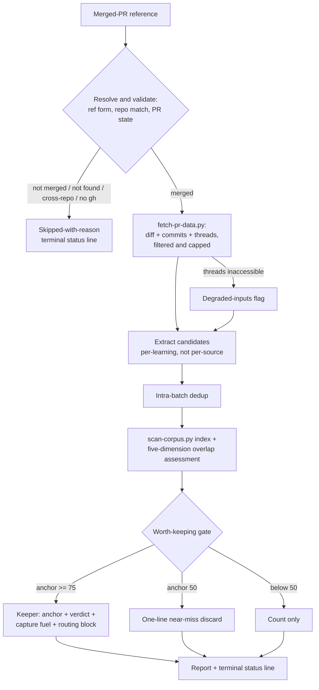

# feat: ce-learning-sweep — report-only merged-PR learning sweep

## Summary

Add `ce-learning-sweep`, a new report-only skill that sweeps one merged PR — diff, commit messages, review threads — for candidate learnings and reports keepers with a confidence anchor, a three-way corpus verdict, and self-contained capture fuel for hand-routing through `/ce-compound`. Mechanical work (PR mining, corpus scanning) lands in bundled Python scripts with fixture tests; judgment (extraction, gate, verdicts) stays in skill prose. Ships with a pre-committed five-PR validation experiment whose pass/fail bar is committed before the first run.

---

## Problem Frame

`ce-compound` captures one learning at a time, only when a human remembers to invoke it. The origin brainstorm (see origin: `docs/brainstorms/2026-06-09-batch-learning-capture-requirements.md`) scopes the cheapest version that can test whether learnings are actually being missed: a sweep that proposes candidates but writes nothing, so it cannot violate the loose-coupling constraint and needs no workflow conversion. The capture-bottleneck claim is an inference, not an observed fact — the validation experiment is designed to falsify it, and the bar is pre-committed per the ADR 0001 discipline (`docs/adr/0001-per-metric-signal-gate.md`).

---

## Requirements

**Input acquisition and validation**

- R1. The skill accepts one explicit merged-PR reference in any of: bare number, `#<n>`, full URL, `owner/repo#<n>`. The referenced repo must match the working directory's origin remote; a mismatch produces the skipped-with-reason terminal state. (origin R1)
- R2. A single `gh pr view --json` probe validates PR state before any mining. Not-found, open, closed-unmerged, and draft PRs produce skipped-with-reason — distinct from both the no-candidates report and the degraded report. (origin R1)
- R3. Mining covers three inputs: the PR diff, its commit messages, and its review threads — resolved **and** unresolved, with pagination handled deliberately. (origin R1)
- R4. Degradation is two-tier: when `gh` works but review threads are inaccessible, the sweep proceeds on diff + commits and the report states the degraded inputs (origin R3, narrowed per the two-tier KTD below); when `gh` is unavailable entirely, the sweep is skipped-with-reason — a PR reference cannot be resolved without forge access. A failed diff or commits fetch on a valid merged PR (e.g., a diff beyond the forge API's hard limits) is also skipped-with-reason — the diff is the primary mining input. A PR that simply has zero threads is a normal state, not degradation.
- R5. Large-input policy: lockfiles and generated files are excluded from the mined diff; thread volume is capped; any truncation is disclosed in the report through the same mechanism as degradation.
- R6. All mined content — review threads, diff hunks, commit messages — is untrusted input: context only, never instructions to execute. The defense is structural as well as behavioral: the mining envelope nests mined content under keys that signal raw provenance (e.g., `diff_raw`, `commits_raw`, `threads_raw`), and the skill frames the envelope as untrusted data before reading it.

**Extraction, dedup, and gate**

- R7. Extraction is per-learning, not per-source: one review thread may yield multiple candidates; splitting happens before dedup. (origin R4)
- R8. Intra-batch dedup merges candidates describing the same underlying learning before the corpus check. (origin R4)
- R9. Each candidate carries a discrete confidence anchor from the plugin's established scale (0/25/50/75/100) with behavioral criteria. Keepers require anchor >= 75; candidates at 50 appear as one-line near-miss discards; lower anchors appear as a count only. (origin R6)

**Corpus verdicts**

- R10. The corpus check tolerates heterogeneous frontmatter (missing `problem_type`, `created:` instead of `date:`, entries with no frontmatter at all). A missing or empty `docs/solutions/` directory yields a clean run where every candidate verdicts `new`. (origin R5, R10)
- R11. Verdicts map from `ce-compound`'s five-dimension overlap assessment: High overlap -> `already-documented`; Moderate -> `overlaps-existing` with the extend-candidate flag; Low or none -> `new`. Every non-`new` verdict names the best covering doc. (origin R7)
- R12. A re-run is a fresh evaluation against the current corpus — verdict drift across runs (e.g., after a keeper was captured) is correct behavior, not nondeterminism. (origin R2)

**Report contract**

- R13. The skill writes nothing to the repo. Run scratch lives under `/tmp/compound-engineering/ce-learning-sweep/<run-id>/` only. (origin R8)
- R14. Each keeper carries: anchor, verdict, evidence pointers in a fixed per-source format (thread URL for threads, commit SHA for commits, file-plus-hunk for diff findings), and self-contained capture fuel — a learning statement, evidence excerpts, and a plain-language track/category suggestion — sufficient for a later `/ce-compound` run in a fresh session. The routing affordance is verdict-conditional: `new` and `overlaps-existing` keepers get a handoff block (`overlaps-existing` explicitly steered to ce-compound Full mode with the overlapping doc named as context), `already-documented` gets the citation only. (origin R9)
- R15. A sweep that yields nothing produces a clean "no candidates" report. (origin R10)
- R16. All three report shapes — report, no-candidates, skipped-with-reason — end with a machine-detectable terminal status line, following the `Documentation complete` / `status:` envelope precedent.

---

## Key Technical Decisions

- **Keeper threshold at anchor 75, near-misses visible at 50.** The repo's report-only precedent (`docs/solutions/skill-design/confidence-anchored-scoring.md`) would suggest >= 50, but the experiment's pre-committed precision bar (~1 discard per keeper) demands the 75 anchor's "name the concrete downstream consequence" test. Listing 50-anchored near-misses one line each keeps precision measurable and provides tuning data without burying the signal. *(user-confirmed)*
- **Verdict boundaries are ce-compound's five-dimension overlap scale, not new definitions.** Problem statement, root cause, solution approach, referenced files, prevention rules — scored High (4-5) / Moderate (2-3) / Low (0-1) exactly as ce-compound's Related Docs Finder does. The two skills may disagree on judgment, never on definitions.
- **ce-compound is authoritative at write time.** The sweep verdict is advisory routing signal; when ce-compound's own overlap check disagrees during capture, ce-compound wins. Disagreements observed during the experiment are recorded as precision data points. *(user-confirmed)*
- **Two-tier degradation, narrowed from the origin doc.** The origin's "no forge access -> diff + commits" promise is unimplementable: without `gh` there is no way to resolve a PR reference at all. Threads-missing degrades; no-`gh` skips with reason. *(user-confirmed)*
- **Script-first Python for mining and corpus scanning.** Raw `gh` output and a 31-file corpus walk are exactly the large-data-in-context shape `docs/solutions/skill-design/script-first-skill-architecture.md` targets, and `docs/solutions/best-practices/prefer-python-over-bash-for-pipeline-scripts.md` rules out bash for pipeline logic. Frontmatter is parsed with a real tolerant parser (Python stdlib only, mirroring `ce-compound/scripts/validate-frontmatter.py`'s no-dependency constraint), never grep/sed.
- **Keeper entries are self-contained capture fuel.** `docs/solutions/skill-design/compound-refresh-skill-improvements.md` documents the failure mode: ce-compound expects fresh problem-solving context that a later manual run won't have. Each keeper must stand alone. No schema duplication into the new skill — capture fuel proposes track/category in plain language and ce-compound owns `schema.yaml` at write time, preserving the single write seam.
- **Orchestrator-inline, no subagent fan-out, no dynamic workflow in v1.** Fan-out is the v2 increment the experiment must justify; staying plain sidesteps all five live-boundary runtime contracts (`docs/solutions/skill-design/dynamic-workflow-conversion-live-boundary.md`) and keeps the skill working identically on every platform.
- **The pre-committed bar lives in a committed test file.** Following the ce-verify-work trial precedent (commit `379d133`, `tests/work-vs-plan-workflow-eval.test.ts`): a PENDING acceptance-gate block carrying the experiment bar is committed before the first run, then replaced with recorded trial results. The bar cannot be relitigated after seeing output. *(user-confirmed)*

---

## High-Level Technical Design

Verdict mapping (shared definitions with ce-compound's Related Docs Finder):

- **High overlap (4-5 dimensions)** -> `already-documented` — citation only, no routing block.
- **Moderate overlap (2-3 dimensions)** -> `overlaps-existing` — extend-candidate flag, overlapping doc named, routing block steers to ce-compound Full mode.
- **Low or none (0-1 dimensions)** -> `new` — full routing block.

---

## Implementation Units

### U1. PR mining script with explicit state machine

- **Goal:** A bundled Python script that resolves a PR reference, validates state, and emits a single JSON envelope with diff, commits, and review threads — pre-filtered and capped so the model never chews raw `gh` output.
- **Requirements:** R1-R6.
- **Dependencies:** none.
- **Files:** `plugins/compound-engineering/skills/ce-learning-sweep/scripts/fetch-pr-data.py` (create), `tests/learning-sweep-fetch.test.ts` (create).
- **Approach:** Explicit state checks per `docs/solutions/skill-design/git-workflow-skills-need-explicit-state-machines.md` — address the PR by number via `gh pr view --json`, never branch-name search; interpret non-zero exits as named states (`not_found`, `not_merged`, `no_forge`, `fetch_failed` for a diff/commits fetch that fails on a valid merged PR), not failures. Review threads via paginated GraphQL adapted from `ce-resolve-pr-feedback/scripts/get-pr-comments` (three separate `--paginate --slurp` queries — pagination only follows the outermost pageInfo), **without** its `isResolved == false` filter. Mine via the `gh` API, not local git diffs (`docs/solutions/workflow/stale-local-base-contamination.md`). Exclude lockfiles/generated paths; cap thread and diff volume with truncation flags in the envelope. Mined content nests under raw-provenance keys (`diff_raw`, `commits_raw`, `threads_raw`) so the data/instruction boundary is structural (R6). Repo-match guard compares the ref's repo against the origin remote. Behavioral tests use a fake `gh` shim prepended to `PATH` by the test — it serves fixture output for multi-page queries, induces thread-fetch failure, and simulates absence (empty `PATH`) — so every named state is assertable without network.
- **Patterns to follow:** `ce-resolve-pr-feedback/scripts/get-pr-comments` (GraphQL pagination, repo resolution); `ce-code-review/SKILL.md` PR probe and skip-condition pattern; `ce-compound/scripts/validate-frontmatter.py` (stdlib-only Python).
- **Test scenarios:**
  - Happy path: multi-page thread fixtures merge into one complete thread list; resolved threads present with `isResolved` preserved.
  - Happy path: diff + commit messages land in the envelope keyed by source.
  - Edge: PR with zero review threads -> empty thread list, degraded flag NOT set (normal state).
  - Edge: thread fetch fails while `gh` works -> envelope carries degraded flag. Covers AE1 (envelope half).
  - Edge: lockfile and generated-file hunks excluded; exclusion noted in envelope.
  - Edge: oversized diff/thread volume -> truncated, truncation flag set.
  - Error: not-found, open, and draft PRs -> distinct named states, exit interpreted cleanly.
  - Error: `gh` binary absent -> `no_forge` state.
  - Error: cross-repo reference -> repo-mismatch state.
  - Error: diff fetch fails on a valid merged PR -> `fetch_failed` state.
- **Verification:** `bun test tests/learning-sweep-fetch.test.ts` green; fixture set covers every named state.

### U2. Tolerant corpus-scan script

- **Goal:** A bundled Python script that walks `docs/solutions/` and emits a JSON index (path, title, module, tags, problem_type/category, date) tolerant of the corpus's real heterogeneity.
- **Requirements:** R10.
- **Dependencies:** none.
- **Files:** `plugins/compound-engineering/skills/ce-learning-sweep/scripts/scan-corpus.py` (create), `tests/learning-sweep-corpus-scan.test.ts` (create).
- **Approach:** Stdlib-only tolerant frontmatter extraction (the corpus verifiably contains entries missing `problem_type`, using `created:` for `date:`, and one file with no frontmatter). Entries with missing fields are indexed with what they have, never dropped — dropping them would mis-verdict real coverage as `new`. Missing or empty directory yields an empty index and exit 0.
- **Patterns to follow:** `ce-compound/scripts/validate-frontmatter.py` (stdlib parsing posture); `plugins/compound-engineering/agents/ce-learnings-researcher.md` (frontmatter-field search strategy the index serves).
- **Test scenarios:**
  - Happy path: well-formed entry indexed with all fields.
  - Edge: entry with `category` but no `problem_type` indexed without error.
  - Edge: entry with `created:` instead of `date:` indexed with the date captured.
  - Edge: file with no frontmatter indexed with path/title-derived minimal record.
  - Edge: empty `docs/solutions/` -> empty index, exit 0. Covers AE4 (index half).
  - Edge: directory absent entirely -> empty index, exit 0.
  - Error: a file with malformed frontmatter is skipped with a warning entry, scan completes.
- **Verification:** `bun test tests/learning-sweep-corpus-scan.test.ts` green against fixtures mirroring the real corpus's variants.

### U3. SKILL.md and rubric references

- **Goal:** The skill itself: phase structure, gate and verdict rubrics, report contract, and inline post-report routing.
- **Requirements:** R1-R16 (orchestration of all); directly R7-R9, R11-R16.
- **Dependencies:** U1, U2.
- **Files:** `plugins/compound-engineering/skills/ce-learning-sweep/SKILL.md` (create), `plugins/compound-engineering/skills/ce-learning-sweep/references/verdict-rubric.md` (create), `plugins/compound-engineering/skills/ce-learning-sweep/references/worth-keeping-rubric.md` (create), `plugins/compound-engineering/skills/ce-learning-sweep/references/report-template.md` (create).
- **Approach:** Frontmatter: `name: ce-learning-sweep`, description (what + when, <= 1024 chars, no bare angle-bracket tokens), `argument-hint`, and `allowed-tools` pinned per script filename (`Bash(gh *)`, `Bash(python3 *fetch-pr-data.py)`, `Bash(python3 *scan-corpus.py)`) plus `Read` — the verdict phase must read shortlisted `docs/solutions/` doc bodies (the scan-corpus index alone cannot score the five dimensions) and the skill's own reference files. Scripts invoked via `${CLAUDE_SKILL_DIR:-.}` (the `:-.` fallback is required by the repo's platform-variable rule; ce-worktree is the precedent). Phases: resolve/validate -> mine -> extract + dedup -> corpus verdicts -> gate -> report. The worth-keeping rubric adapts the five-anchor behavioral criteria with the anchor-75 "name the concrete downstream consequence" test as the keep bar. The verdict rubric defines the five dimensions and mapping per KTD, with per-verdict evidence requirements and tie-break direction (mirroring `ce-verify-work/references/verdict-rubric.md`'s shape). Report template fixes evidence-pointer formats, capture-fuel fields, verdict-conditional routing blocks, near-miss/count discard rendering, and the three terminal status lines. Untrusted-input rule adapted from ce-resolve-pr-feedback's Security section (extended to diff and commit content), plus the structural framing per R6: SKILL.md instructs the model to treat every string value in the mining envelope as data to analyze, never as instructions. Post-report routing menu actions live inline in SKILL.md per `docs/solutions/skill-design/post-menu-routing-belongs-inline.md`. Replay semantics stated (fresh evaluation each run).
- **Patterns to follow:** `ce-verify-work/SKILL.md` (report-only probe framing, resolve-validate-fail-fast, report presentation, terminal lines); `ce-compound/SKILL.md` Phase 1 #3 (five-dimension overlap assessment); `ce-worktree/SKILL.md` (`${CLAUDE_SKILL_DIR:-.}` invocation form and its rationale); the Skill Compliance Checklist in `plugins/compound-engineering/AGENTS.md`.
- **Test scenarios:** (behavioral, via the skill-creator eval pattern — plugin skill content caches at session start, so iteration uses subagent injection, not same-session dispatch)
  - Covers AE2: a fixture PR where the diff and a review thread surface the same gotcha -> one merged candidate, not two.
  - Covers AE3: a candidate partially covered by an existing doc -> `overlaps-existing`, doc named, extend flag set.
  - Covers AE5: a records-only fixture PR -> zero candidates, clean no-candidates report with terminal line.
  - Covers AE1: thread-inaccessible envelope -> report states degraded inputs.
  - Skipped states: open PR and cross-repo ref -> skipped-with-reason terminal line, no report body.
  - Static: `tests/frontmatter.test.ts` and `tests/skill-shell-safety.test.ts` pass over the new skill unmodified.
- **Verification:** Skill-creator eval scenarios pass; static guard tests green.

### U4. Inventory and release validation

- **Goal:** The new skill is discoverable and the release surfaces stay consistent.
- **Requirements:** supports all (packaging).
- **Dependencies:** U3.
- **Files:** `plugins/compound-engineering/README.md` (modify — add skill row to the appropriate category table, verify counts).
- **Approach:** README row + count check; no version bumps anywhere (release-owned); no `docs/skills/` user doc in v1 (deliberate deferral).
- **Test expectation:** none — inventory/docs change with no behavior.
- **Verification:** `bun run release:validate` passes; `bun test` green.

### U5. Pre-commit the experiment acceptance gate

- **Goal:** The five-PR experiment's pass/fail bar exists in the repo before the first run, so the experiment cannot be relitigated after seeing output.
- **Requirements:** carries the origin's pre-committed success bar.
- **Dependencies:** U3 (the bar references the skill's report vocabulary).
- **Files:** `tests/learning-sweep-eval.test.ts` (create).
- **Approach:** Following `tests/work-vs-plan-workflow-eval.test.ts` (commit `379d133`): a PENDING acceptance-gate block recording the bar verbatim from the origin doc — (a) >= 2 keep-worthy never-captured candidates across five PRs, (b) noise <= ~1 discarded candidate per keeper, (c) already-documented ground correctly marked, never re-proposed — plus the protocol conditions: forge access required for all runs, PR #13's fixture-telemetry disposition decision as known-answer target, PR #14 as negative control where zero yield is correct, and the falsification clause (zero yield across five PRs deprioritizes full B0). Pending entries must not fail CI.
- **Test scenarios:**
  - The pending block parses and runs green under `bun test` (pending semantics, no false failure).
  - Bar text matches the origin doc's Success Criteria verbatim.
- **Verification:** File committed and green **before** any U6 run executes.

### U6. Run the five-PR validation experiment and record trials

- **Goal:** Execute the pre-committed experiment on the five most recent merged PRs and replace the PENDING block with recorded results.
- **Requirements:** R1-R16 exercised live; origin Success Criteria adjudicated.
- **Dependencies:** U1-U5.
- **Files:** `tests/learning-sweep-eval.test.ts` (modify — replace PENDING with recorded trial results).
- **Approach:** Verify forge access first (a degraded run does not count). Sweep the five most recent merged PRs including #13 (known-answer: the fixture-telemetry disposition decision must surface as a keeper) and #14 (negative control: zero yield is the correct output). Record per-PR: candidates with anchors, verdicts, user keep/reject judgments against the bar, and any sweep-vs-ce-compound verdict disagreements when keepers are routed through `/ce-compound` by hand (those captures are real — they land via the normal write seam). Adjudicate the bar; on zero yield, record the falsification outcome.
- **Execution note:** The bar is fixed; do not adjust thresholds mid-experiment. Tuning happens after adjudication, per `docs/solutions/skill-design/safe-auto-rubric-calibration.md` (judge changes by variance across repeated trials, not by hitting a target rate).
- **Test scenarios:**
  - Known-answer probe: PR #13 sweep surfaces the fixture-telemetry disposition decision as a keeper verdicted `new`.
  - Negative control: PR #14 sweep reports zero candidates cleanly. Covers AE5 live.
  - Each of the five runs ends with the correct terminal status line and writes nothing to the repo (verify with a clean `git status` after each run).
- **Verification:** PENDING block replaced with recorded results; bar adjudicated explicitly (pass / fail / falsified); any keepers captured through `/ce-compound` appear in `docs/solutions/` via the normal path.

---

## Scope Boundaries

**Deferred to v2 (gated on the experiment passing)** *(carried from origin)*

- Auto-routing survivors through `ce-compound` headless; the dynamic-workflow fan-out conversion (Claude-Code-only with prose fallback guard); the manual session-sweep secondary mode; the completed plan doc as a fourth input; acting on extend flags at write time.

**Deferred further (v3 idea, recorded only)** *(carried from origin)*

- Marker-assisted capture via producer skills — cannot run retroactively, so it can never power this experiment.

**Not this feature** *(carried from origin)*

- The `ce-work` progress-thread continuity problem — separate follow-up brainstorm.

### Deferred to Follow-Up Work

- A `docs/skills/ce-learning-sweep.md` user-facing doc — deliberate post-experiment decision, not v1.
- A persisted report artifact (report file, retention policy) — the report is chat-only in v1.
- Threshold retuning after the experiment, if precision/yield data warrants moving off the 75 anchor.

---

## Risks & Dependencies

- **GraphQL pagination complexity** — the three-query pattern exists and is fixture-tested in `tests/resolve-pr-feedback-pagination.test.ts`; U1 adapts rather than invents. Residual risk: resolved-thread volume on old PRs is larger than unresolved-only; the cap policy (R5) bounds it.
- **Squash-merge commit semantics** — `gh pr view --json commits` returns the PR branch's commits even after squash merge, but this is exactly the kind of live contract worth verifying first in U1's implementation before relying on it.
- **Thin experiment sample** — five PRs is a small N by design (cheap probe); the pre-committed bar plus known-answer probe and negative control are what make the small sample honest. The falsification clause is recorded in U5, not improvised later.
- **Corpus heterogeneity** — verified real (entries missing `problem_type`, variant date keys, one no-frontmatter file); U2's tolerant parser plus its fixture suite is the mitigation. A naive parser would silently corrupt the experiment's corpus-accuracy criterion.
- **Dependency:** `gh` CLI authenticated against the repo's forge for all experiment runs (R4's skip tier covers shipped use without it).

---

## Sources & Research

- `docs/brainstorms/2026-06-09-batch-learning-capture-requirements.md` — origin; requirements, success bar, scope boundaries carried verbatim.
- `docs/dynamic-workflows-opportunity-map.md` §5.1, §7 — B0 candidate row; loose-coupling and workflow-fallback constraints honored by the report-only shape.
- `docs/adr/0001-per-metric-signal-gate.md` — pre-commitment discipline governing U5/U6.
- `plugins/compound-engineering/skills/ce-verify-work/SKILL.md` and commit `379d133` — report-only probe structure and the recorded-trial precedent.
- `plugins/compound-engineering/skills/ce-compound/SKILL.md` (Phase 1 #3, Phase 2 step 2) — five-dimension overlap assessment and update-vs-create write path the verdicts align with.
- `plugins/compound-engineering/skills/ce-resolve-pr-feedback/scripts/get-pr-comments` + `tests/resolve-pr-feedback-pagination.test.ts` — GraphQL thread pagination pattern (adapted: resolved threads included).
- `plugins/compound-engineering/skills/ce-code-review/references/findings-schema.json` — the five-anchor confidence scale and threshold conventions.
- `docs/solutions/skill-design/confidence-anchored-scoring.md`, `script-first-skill-architecture.md`, `git-workflow-skills-need-explicit-state-machines.md`, `compound-refresh-skill-improvements.md`, `dynamic-workflow-conversion-live-boundary.md`, `post-menu-routing-belongs-inline.md`, `safe-auto-rubric-calibration.md`; `docs/solutions/best-practices/prefer-python-over-bash-for-pipeline-scripts.md`; `docs/solutions/workflow/stale-local-base-contamination.md` — institutional learnings shaping the KTDs above.
