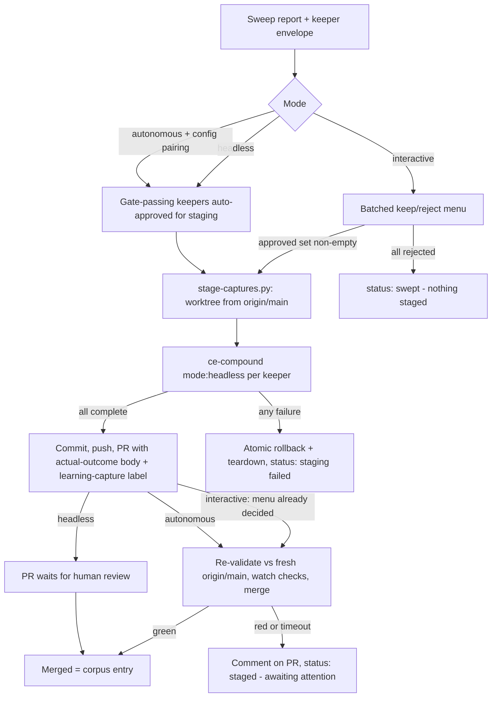

# feat: Close the capture loop and drift read edge

## Summary

Extend `ce-learning-sweep` with a write edge (one batched keep/reject decision; approved keepers captured through `ce-compound mode:headless` in an isolated worktree and staged as a capture PR) and a trigger edge (a Claude Code routine recipe on the PR-merge webhook), add `mode:autonomous` behind an explicit parameter with a pre-committed agreement gate, and ship the drift loop's read edge as a new report-only `ce-drift-report` skill aggregating `docs/drift-events/` at read time.

---

## Problem Frame

The capture loop's judgment quality is proven (five-PR experiment, adjudicated PASS) but both remaining edges run on human effort: sweeps happen only when remembered, and routing keepers through `/ce-compound` costs a per-keeper invocation plus re-feeding context the report already contains (observed on the nine hand-routed keepers, commit `fea7add`). The drift loop has the inverse gap: `ce-verify-work` captures drift events durably, but nothing reads across them, so the telemetry produces no signal. The origin doc names the system goal — the developer authors loops, the system runs them, the human holds the corpus gate — and this plan is its first full closure. (see origin: `docs/brainstorms/2026-06-12-loop-system-capture-closure-requirements.md`)

---

## Requirements

Carried from the origin doc; IDs match the origin's R-IDs.

**Loop-system contract**

- R1. Loops name their judgment points; default mode prompts the human at each. (origin R1)
- R2. An explicit autonomous parameter lets a run traverse judgment points using the pre-committed gate — opt-in per run or per deliberate configuration, never inherited from a trigger, always leaving a reviewable record. (origin R2)
- R3. Edges graduate manual → automatic only via a passed ADR 0001 signal gate. The trigger and write-execution edges are authorized by the five-PR experiment PASS (`tests/learning-sweep-eval.test.ts`); autonomous corpus entry is a new edge and earns its own gate before being recommended. (origin R3)

**Capture loop — write edge**

- R4. One batched keep/reject decision per sweep run — never per-keeper invocations. (origin R4)
- R5. Approved keepers captured through `ce-compound` mechanically; the keeper envelope flows without human re-supply; `ce-compound` stays the sole write seam and is authoritative at write time, with disagreements recorded and surfaced. (origin R5)
- R6. Captures staged as a branch + PR of proposed `docs/solutions/` entries; merge = corpus entry; default mode stops at PR-open; staged writes framed as proposals. (origin R6)
- R7. Manual runs may resolve keep/reject in an in-session menu in front of the same branch+PR machinery; the menu decision authorizes merge-on-green. (origin R7)
- R8. Keep decisions are re-validated against the current corpus at decision/merge time so a stale approval can never land an already-documented entry. (origin R8)

**Capture loop — trigger edge**

- R9. Sweeps fire on merge or schedule without being remembered; manual per-PR invocation unchanged. (origin R9)
- R10. Unattended runs default to stage-and-await-review; autonomous merge on a triggered run requires the explicit configuration pairing. (origin R10)

**Drift loop — read edge**

- R11. An aggregation reads `docs/drift-events/`, derives rates at read time (per plan and cross-plan), stores no rate anywhere, and is report-only. (origin R11)
- R12. Low-confidence and degraded events are included and flagged, never silently dropped. (origin R12)

**Platform reach**

- R13. Trigger and orchestration machinery may be Claude-Code-only; every other platform retains a fully functional manual path. (origin R13)

**Handoff hygiene** *(user-added during plan review)*

- R14. At plan completion, everything the implementer needs exists in the plan artifact — unresolved document-review findings included — and the post-plan menu offers a fresh-context handoff route alongside in-session execution, so `ce-work` can start in a clean context window with zero loss.

---

## Key Technical Decisions

- **The write edge lives inside `ce-learning-sweep` as new closing phases, not a separate skill.** The existing Phase 7 post-report menu is already the seam; one entry point serves interactive, headless, and autonomous runs, and the keeper envelope stays internal to one skill (skill self-containment — no cross-skill schema duplication). *(user-confirmed at synthesis)*
- **`ce-compound mode:headless` is the entire write seam.** It exists today, accepts a prose context blob, writes without prompts, and emits machine-detectable terminal signals (`Documentation complete` / `Documentation skipped`). The orchestration branches on those signals — pinned by a test so contract drift is caught. No new write machinery. One caveat discovered in review: headless ce-compound's write surface is wider than `docs/solutions/` — it silently applies instruction-file (`AGENTS.md`/`CLAUDE.md`) Discoverability edits and `CONCEPTS.md` vocabulary writes. In staged-capture context those side-effect writes are suppressed: the staging dispatch instructs ce-compound to surface them as terminal-report recommendations instead, carried into the PR body for the human to apply by hand, and U5's path allowlist rejects any that slip through.
- **Staging runs in a temporary worktree branched from `origin/main`.** `git fetch --no-tags origin main && git worktree add <dir> -b <branch> origin/main` — never local `main` (stale-base contamination, `docs/solutions/workflow/stale-local-base-contamination.md`); the developer's checkout is never touched; teardown executes on every terminal path (success, failure, abort).
- **Batch staging is atomic.** A mid-batch `ce-compound` failure rolls back the branch and worktree and reports the failed keeper; the user retries the whole batch. The PR must equal the approved set — partial PRs misrepresent the decision. Abort teardown removes the worktree AND deletes the local branch ref (no remote push has occurred on the abort path), leaving zero state. Retries run against a possibly-moved corpus: the envelope's `overlapping_doc` is advisory at retry time — ce-compound's write-time overlap check is authoritative on retry, consistent with R5. *(user-confirmed at synthesis)*
- **Git mechanics live in a state-machine script; judgment stays in skill prose.** `stage-captures.py` (stdlib Python) owns worktree lifecycle, commit, push, PR creation, merge, rollback, and teardown as named states with named failure outcomes (`docs/solutions/skill-design/git-workflow-skills-need-explicit-state-machines.md`, `docs/solutions/best-practices/prefer-python-over-bash-for-pipeline-scripts.md`). `ce-compound` dispatches happen at the model layer between script calls.
- **The PR body is assembled after capture, from `ce-compound`'s actual outcomes.** Per keeper: sweep verdict, ce-compound's actual action (created path vs updated-in-place path), and any verdict disagreement — so the audit record matches the diff, including when ce-compound's overlap check overrides a `new` verdict.
- **Mode matrix: `interactive` (default) / `mode:headless` / `mode:autonomous`.** Headless defers the judgment point (stage + PR waits); autonomous applies the gate (anchor ≥ 75 keeps) and merges on green — these are distinct concepts per CONCEPTS.md. Autonomy on a triggered run additionally requires `learning_sweep_autonomous: true` in `.compound-engineering/config.local.yaml` (precedent: `work_delegate_decision`); the parameter is never trigger-implied. The config pairing is resolved in the main checkout before any worktree exists — gitignored config is per-worktree and would not be found inside the staging worktree; a missing key downgrades a triggered autonomous run to headless with the downgrade stated in the report. The skill must NOT carry `disable-model-invocation` (it blocks scheduled invocation).
- **Autonomy is gated on content safety AND agreement — the agreement gate is a quality gate, not a safety gate.** A poisoned-but-plausible entry would pass keep/reject agreement cleanly, so autonomous mode additionally requires deterministic content pre-conditions enforced by `validate-staged-keepers.py` regardless of experiment outcome: the staged diff may touch only `docs/solutions/**/*.md` (never `.github/`, scripts, tests, manifests, or the agent-steering files `AGENTS.md`/`CLAUDE.md`/`CONCEPTS.md`); entry slugs are traversal-safe; per-entry and per-PR diff sizes are capped. The allowlist is also what keeps the CI gate tamper-resistant — without it a capture PR could modify the validator itself.
- **A capture PR is identified by three signals together: the `learning-capture/` branch prefix, the `learning-capture` label, and the authoring identity — never by namespace alone.** The label is a routing tag, not a vetting stamp; a human-pushed branch wearing the namespace fails the identity check and gets normal scrutiny. The prefix/label strings are pinned constants verified verbatim across the skill, the trigger recipe, and the validator by a test — drift in any copy silently breaks self-sweep exclusion, gate activation, and the already-swept probe. Capture PR titles use the canonical `docs(learnings): capture <K> entries from PR #<n>` form: it passes the semantic-PR-title check, and `docs:` commits do not trigger release-please (verified against the config during U2; fallback if behavior differs: `exclude-paths` for `docs/solutions/` on the compound-engineering package).
- **The trigger ships as a configuration recipe, not code.** Primary: a Claude Code routine with a GitHub webhook trigger on `pull_request.closed` filtered to `is_merged: true` (per-merge, matching the sweep's one-PR-per-run contract); documented alternative: GitHub Actions with `claude-code-action`. Hooks and `/loop` are not viable (session-scoped; no git events). *(user-confirmed at synthesis)*
- **Trigger hygiene prevents self-sweeping and re-proposal.** Capture PRs carry the `learning-capture` label and `learning-capture/` branch prefix and are excluded by the trigger filter and by a skill-level short-circuit. Triggered sweeps skip source PRs that already have a capture PR — merged, open, or closed-unmerged (a closed capture PR is a durable rejection record); manual re-sweeps always re-evaluate fresh. *(user-confirmed at synthesis)*
- **Re-validation is a hard gate, not advisory.** `validate-staged-keepers.py` runs inside `bun test` (so the `test` check fails on a capture PR whose staged entries highly overlap the current corpus), and skill-mediated merges re-run it against fresh `origin/main` at merge time. The validator fetches `origin/main` fresh before comparing — a CI runner's remote-tracking ref is stale by workflow-trigger time. Activation keys on the `learning-capture/` branch prefix, never file paths alone, so a human adding a solutions doc in a normal PR cannot trip the gate. The merge path additionally detects `stale_update_in_place` — an update-in-place target that `origin/main` has also modified since the branch base — and blocks for reconciliation rather than risking silent last-write-wins. Residual: a human merging a long-stale capture PR through the GitHub UI relies on the CI-at-last-push check; mitigation documented (recommend a require-branches-up-to-date ruleset), not enforced. *(user-confirmed at synthesis)*
- **The drift read edge is a new skill, `ce-drift-report`, script-first.** A stdlib-Python aggregator (`scan-drift-events.py`) reads events tolerantly (malformed files skip-with-warning per R12's spirit; zero events is an explicit "no drift data yet" report; flagged events included and marked). No dynamic workflow anywhere in this plan — the deterministic math lives in one script that runs identically on every platform, so the live-boundary contract class and the canonical-module dual-path problem are both avoided by construction. Rates derived as |drifted| / |attempted| at read time, never stored (ADR 0001).
- **The autonomy agreement gate is pre-committed before its first trial.** `tests/loop-autonomy-eval.test.ts` carries a PENDING block fixing the bar (agreement between autonomous gate decisions and the human's keep/reject on the same sweeps) before any trial runs, following the `tests/learning-sweep-eval.test.ts` precedent; thresholds are never adjusted mid-experiment (`docs/adr/0001-per-metric-signal-gate.md`, `docs/solutions/skill-design/safe-auto-rubric-calibration.md`).
- **Branch-protection assumption verified live (2026-06-12).** `main` carries rulesets for deletion, non-fast-forward, and Copilot review only — no required-reviewer rule — so menu-approved PRs can merge on green. Merges are skill-driven (watch checks, then merge) rather than relying on forge auto-merge config.

---

## High-Level Technical Design

Capture loop, v2 shape (all modes share the staging machinery):



Staging state machine (owned by `stage-captures.py`; every state has a teardown path):

```mermaid
stateDiagram-v2
  [*] --> WorktreeOpen: open (fetch origin/main, worktree add)
  WorktreeOpen --> Capturing: ce-compound dispatches (model layer)
  Capturing --> Committed: finalize (commit all entries)
  Capturing --> RolledBack: abort (any keeper failed)
  Committed --> Pushed: push
  Pushed --> PROpen: gh pr create (mktemp --body-file)
  Pushed --> OrphanBranch: pr create failed (retry once, then report branch for cleanup)
  PROpen --> Merged: merge path (re-validate, watch checks, merge)
  PROpen --> Waiting: headless path
  RolledBack --> [*]: teardown
  Merged --> [*]: teardown
  Waiting --> [*]: teardown (worktree removed; branch + PR remain)
  OrphanBranch --> [*]: teardown
```



Mode × invocation matrix:

| Invocation | Default mode | `mode:headless` | `mode:autonomous` |
|---|---|---|---|
| Manual (session) | In-session menu → stage → merge on green | Stage → PR waits | Gate decides → stage → merge on green |
| Triggered (routine/Action) | n/a (no session) | Stage → PR waits (the default for triggered runs) | Only with `learning_sweep_autonomous: true` config pairing |
| Non-Claude-Code platform | Manual sweep + PR/in-chat decision (R13) | Manual path | Not offered until the agreement gate passes |

---

## Output Structure

New files only (existing `ce-learning-sweep` files are modified in place):

```
plugins/compound-engineering/skills/ce-learning-sweep/
├── references/staging-workflow.md        # staging sub-flow detail (routing stays inline in SKILL.md)
├── references/trigger-recipe.md          # routine webhook + Actions alternative + filter guidance
└── scripts/stage-captures.py             # git/worktree/PR state machine
plugins/compound-engineering/skills/ce-learning-sweep/scripts/validate-staged-keepers.py
plugins/compound-engineering/skills/ce-drift-report/
├── SKILL.md
├── references/report-template.md
└── scripts/scan-drift-events.py
tests/learning-sweep-envelope.test.ts
tests/learning-sweep-staging.test.ts
tests/learning-sweep-revalidation.test.ts
tests/drift-report-scan.test.ts
tests/loop-autonomy-eval.test.ts
```

---

## Implementation Units

### Phase A — Write edge

### U1. Machine-readable keeper envelope

- **Goal:** The sweep emits, alongside the human report, a machine-consumable keeper envelope so capture execution never needs human re-supply.
- **Requirements:** R5; supports R4.
- **Dependencies:** none.
- **Files:** `plugins/compound-engineering/skills/ce-learning-sweep/SKILL.md` (modify — Phases 5-6), `plugins/compound-engineering/skills/ce-learning-sweep/references/report-template.md` (modify), `tests/learning-sweep-envelope.test.ts` (create).
- **Approach:** Keepers gain a stable per-run `keeper_id`; the run writes `keepers.json` to the run's `/tmp/compound-engineering/ce-learning-sweep/<run-id>/` scratch containing, per keeper: `keeper_id`, anchor, structured verdict (`new` / `overlaps-existing` / `already-documented`), `overlapping_doc` path when applicable, and the capture-fuel text verbatim (the blob `ce-compound mode:headless` consumes). The human report is unchanged in substance; the template adds the envelope pointer. No schema duplication of `ce-compound`'s `schema.yaml` — track/category stays a prose hint.
- **Patterns to follow:** v1's capture-fuel block in `report-template.md`; run-scratch conventions already in the skill.
- **Test scenarios:**
  - Happy path: template pins the envelope's required field names (`keeper_id`, `anchor`, `verdict`, `overlapping_doc`, `capture_fuel`) — substring assertions on `report-template.md`.
  - Edge: template still pins the three v1 terminal status lines (no regression of the recorded-experiment vocabulary).
- **Verification:** `bun test tests/learning-sweep-envelope.test.ts` green; existing static guards (`tests/frontmatter.test.ts`, `tests/skill-shell-safety.test.ts`) pass unmodified.

### U2. Staging state machine: `stage-captures.py`

- **Goal:** A bundled script owning the git mechanics of staged capture — worktree from `origin/main`, atomic finalize/abort, push, PR creation, merge, teardown — as an explicit state machine the skill drives.
- **Requirements:** R5, R6; supports R7, R8, R10.
- **Dependencies:** U1; U5 for the `merge` subcommand only — `open`/`finalize`/`abort`/`teardown` are buildable before U5, but `merge` calls U5's validator and is blocked until it exists. (U5's dependency on U2 covers only the label/prefix constants, so the pair lands in either partial order.)
- **Files:** `plugins/compound-engineering/skills/ce-learning-sweep/scripts/stage-captures.py` (create), `plugins/compound-engineering/skills/ce-learning-sweep/references/staging-workflow.md` (create), `plugins/compound-engineering/skills/ce-compound/SKILL.md` (modify — one-line consumer note naming the terminal signals as a published seam), `tests/learning-sweep-staging.test.ts` (create).
- **Approach:** Subcommand interface mapping to the state diagram: `open` (fetch `origin/main`, `git worktree add` with `learning-capture/pr-<source>-<run-id>` branch), `finalize` (commit staged entries, push, `gh pr create` with `mktemp` + `--body-file` — never stdin — apply `learning-capture` label, body text supplied by the model from actual ce-compound outcomes), `merge` (re-validate via U5's script against fresh `origin/main`, watch checks bounded, merge), `abort` (rollback + teardown), `teardown` (worktree remove; idempotent). Every subcommand emits a JSON envelope with a named `status` — exit 0 for recognized states. PR-create failure after push retries once, then reports the orphan branch name. ce-compound dispatches are NOT in the script — the skill invokes `ce-compound mode:headless` per approved keeper between `open` and `finalize`, branching on `Documentation complete` / `Documentation skipped`; any other outcome → `abort` (atomic batch). The source PR reference is validated as an integer before reaching any git/gh invocation; the label and branch prefix are fixed constants, never derived from mined content; the PR title uses the canonical `docs(learnings):` form; `abort` removes the worktree and deletes the local branch ref.
- **Execution note:** Build the script against the behavioral test harness from the start — every named state assertable with the fake-`gh` PATH shim and a fixture git repo, no network.
- **Patterns to follow:** `scripts/fetch-pr-data.py` (named-state JSON envelopes, stdlib-only); `ce-commit-push-pr` (`mktemp --body-file` PR pattern); `tests/learning-sweep-fetch.test.ts` (gh shim harness).
- **Test scenarios:**
  - Happy path: open → finalize → JSON states in order; branch created from `origin/main` (assert against a fixture remote whose local `main` is deliberately ahead — the staged branch must NOT contain the local-only commit).
  - Happy path: finalize applies the `learning-capture` label and the branch prefix.
  - Edge: abort after partial captures → worktree removed AND local branch ref deleted, no remote push occurred.
  - Edge: teardown is idempotent (second call exits cleanly).
  - Error: non-integer source PR reference → rejected before any git invocation.
  - Integration: the `learning-capture` label/prefix constants appear verbatim in the skill, the trigger recipe, and the validator (pinned-constant test across all three consumers).
  - Edge: empty staged set at finalize → named `nothing_staged` state, no commit, no PR.
  - Error: push succeeds, `gh pr create` fails twice → `orphan_branch` state naming the branch.
  - Error: `gh` absent → `no_forge` state.
  - Integration: pinned-signal test — assert the skill's documented ce-compound terminal signals (`Documentation complete`, `Documentation skipped`) appear verbatim in `ce-compound/SKILL.md`, so seam drift fails CI.
- **Verification:** `bun test tests/learning-sweep-staging.test.ts` green; every state in the state diagram has at least one assertion.

### U3. Interactive batched decision and merge-on-green

- **Goal:** The default-mode sweep ends in one batched keep/reject moment; approved keepers stage and merge without further human execution.
- **Requirements:** R4, R7; supports R8.
- **Dependencies:** U1, U2.
- **Files:** `plugins/compound-engineering/skills/ce-learning-sweep/SKILL.md` (modify — Phase 7 rewrite).
- **Approach:** Replace the v1 per-keeper routing menu with a single batched decision (multi-select keep/reject over all keepers via the platform's blocking question tool; chat-numbered-list fallback per the option-overflow rule when keepers exceed the option cap). Empty approved set short-circuits — no branch, no PR, terminal `status: swept — nothing staged`. Non-empty: persist the approved-keeper subset to the run's scratch (`approved-keepers.json`) immediately after the menu response — the decision survives session interruption — then drive U2's state machine, dispatch ce-compound per approved keeper, finalize, then merge path (re-validate, watch checks bounded, merge). Before opening the worktree, probe for an existing open capture PR for the same source PR; if found, surface a named warning and require confirmation before opening a parallel branch (superseding is valid, silent duplication is not). Per-option routing stays inline in SKILL.md (`docs/solutions/skill-design/post-menu-routing-belongs-inline.md`); the multi-step staging sub-flow detail lives in `references/staging-workflow.md`.
- **Test scenarios:** (behavioral, via the skill-creator eval pattern — plugin skill content caches at session start)
  - Covers AE3: five keepers, three approved → exactly three entries staged in one PR; two rejections recorded in the report.
  - Edge: all keepers rejected → no branch/PR, clean terminal line.
  - Edge: ce-compound fails on keeper 2 of 3 → atomic rollback message names the failed keeper; no partial PR.
  - Edge: an open capture PR already exists for the source PR → warning surfaced and confirmation required before a second branch opens.
  - Static: frontmatter and shell-safety guards pass over the modified skill.
- **Verification:** Eval scenarios pass; the menu decision is the only human moment between report and corpus entry.

### U4. Unattended modes: `mode:headless` and `mode:autonomous`

- **Goal:** The sweep runs without a session — headless stages and waits; autonomous applies the gate and merges — with autonomy explicitly opted into and never trigger-implied.
- **Requirements:** R2, R9 (consumer side), R10; supports R3.
- **Dependencies:** U2, U3.
- **Files:** `plugins/compound-engineering/skills/ce-learning-sweep/SKILL.md` (modify — mode parsing, frontmatter `argument-hint`), `plugins/compound-engineering/skills/ce-learning-sweep/scripts/fetch-pr-data.py` (modify — already-swept probe), `plugins/compound-engineering/skills/ce-setup/references/config-template.yaml` (modify — `learning_sweep_autonomous` key, commented), `CONCEPTS.md` (refine the Autonomous-mode entry if needed), `tests/learning-sweep-fetch.test.ts` (modify — new probe states).
- **Approach:** `mode:` token parsing per the established convention. Headless: no prompts; gate-passing keepers (anchor ≥ 75) auto-approved for staging; PR opens and waits; terminal `status: staged — <K> keeper(s) awaiting review`. Autonomous: same staging, then the merge path; on red checks or watch timeout, comment on the PR and end with `status: staged — awaiting attention` (never auto-close). Triggered+autonomous requires the config pairing read via the standard pre-resolution pattern. Already-swept short-circuit: `fetch-pr-data.py` gains a probe for an existing capture PR for the source PR (by branch prefix/label, any state); headless/triggered runs skip with `status: skipped — already swept (capture PR #<n>)`; manual runs proceed (fresh evaluation, R12-of-origin replay semantics). Staged-capture dispatches instruct ce-compound to suppress its headless side-effect writes (instruction-file Discoverability edits, CONCEPTS.md vocabulary capture) and surface them as terminal-report recommendations carried into the PR body; the U5 allowlist rejects any that slip through. The skill carries no `disable-model-invocation`.
- **Patterns to follow:** `ce-compound`'s `mode:headless` parsing; `docs/solutions/skill-design/compound-refresh-skill-improvements.md` (conservative headless posture); config pre-resolution pattern from `plugins/compound-engineering/AGENTS.md`.
- **Test scenarios:**
  - Covers AE1: triggered headless run with no config pairing → PR waits; nothing merges without human action (eval scenario).
  - Covers AE4: autonomous run → gate decisions (keep/reject/near-miss) all present in the run record; PR body shows what entered (eval scenario).
  - Happy path: `fetch-pr-data.py` reports `capture_pr` (number + state) when one exists for the source PR — fixture-tested via the gh shim.
  - Edge: closed-unmerged capture PR → probe reports it; headless skip honors it (rejection suppression).
  - Error: config key absent + `mode:autonomous` on a triggered run → falls back to headless staging with the fallback stated in the report.
  - Edge: ce-compound's terminal report carries a side-effect recommendation (instruction-file or CONCEPTS edit) → it appears in the PR body; no agent-steering file change is staged (eval scenario).
- **Verification:** `bun test tests/learning-sweep-fetch.test.ts` green with new states; eval scenarios pass.

### Phase B — Staleness gate

### U5. Hard re-validation gate: `validate-staged-keepers.py`

- **Goal:** A stale capture PR cannot land an already-documented entry — enforced by CI and by the skill's merge path, not by advice.
- **Requirements:** R8.
- **Dependencies:** U2 (branch/label conventions).
- **Files:** `plugins/compound-engineering/skills/ce-learning-sweep/scripts/validate-staged-keepers.py` (create), `tests/learning-sweep-revalidation.test.ts` (create).
- **Approach:** Stdlib Python. Activation discriminator: the `learning-capture/` branch prefix (available from the CI environment's head-ref and from the local branch name) — never file paths alone, so a human adding a solutions doc in a normal PR cannot trip the gate. The script fetches `origin/main` fresh before comparing (a runner's remote-tracking ref is stale by workflow-trigger time), then enforces two gates: (1) the content allowlist — the staged diff may touch only `docs/solutions/**/*.md`; anything else (workflows, scripts, tests, manifests, `AGENTS.md`/`CLAUDE.md`/`CONCEPTS.md`) exits non-zero; slugs must be traversal-safe; per-entry and per-PR diff sizes are capped — and (2) the staleness check — high-overlap collisions between staged entries and the current corpus index (reusing `scan-corpus.py`'s tolerant index; title/tags/module heuristic, the deterministic subset of the five-dimension assessment) exit non-zero. Wired into `bun test` via a test that detects capture-PR context by branch prefix and skips otherwise — the repo's existing `test` check becomes the hard gate with zero cost elsewhere. The skill's merge subcommand (U2) re-runs the script against freshly fetched `origin/main` at merge time, and additionally detects `stale_update_in_place` (an update-in-place target modified on `origin/main` since the branch base) and blocks for reconciliation.
- **Patterns to follow:** `scan-corpus.py` (tolerant index, stdlib); `tests/learning-sweep-corpus-scan.test.ts` (fixture harness).
- **Test scenarios:**
  - Covers AE2: staged entry duplicating a corpus doc that landed after staging → non-zero exit naming the collision pair (fixture advances `origin/main` between push-time and check-time to prove the fresh fetch runs).
  - Happy path: staged entry with no corpus overlap → exit 0.
  - Edge: non-capture branch name → validation skips entirely (a normal PR adding a solutions doc is unaffected).
  - Edge: `overlaps-existing` keeper staged as an update-in-place to its named doc → not flagged (modifying the overlapping doc is the intended action, not a collision).
  - Edge: update-in-place target also modified on `origin/main` since branch base → `stale_update_in_place`, merge blocked with the conflicting paths named.
  - Error: staged diff touches a workflow file or `AGENTS.md` → allowlist rejection, non-zero exit.
  - Error: traversal-shaped slug (`../`, absolute path) → rejected.
  - Error: oversized entry or PR diff → rejected with the cap named.
  - Error: malformed staged file → warning entry, validation completes on the rest.
- **Verification:** `bun test tests/learning-sweep-revalidation.test.ts` green; a fixture capture-PR scenario fails the gate end-to-end.

### Phase C — Trigger edge

### U6. Trigger recipe and hygiene

- **Goal:** Sweeps fire on PR merge without anyone remembering — via documented, user-applied configuration.
- **Requirements:** R9, R13; supports R10.
- **Dependencies:** U4, U5.
- **Files:** `plugins/compound-engineering/skills/ce-learning-sweep/references/trigger-recipe.md` (create), `plugins/compound-engineering/skills/ce-learning-sweep/SKILL.md` (modify — reference the recipe from the mode documentation), `plugins/compound-engineering/README.md` (modify — trigger mention in the skill row).
- **Approach:** Recipe documents the primary path — a Claude Code routine (claude.ai/code/routines or `/schedule`) with a GitHub webhook trigger on `pull_request.closed` filtered to `is_merged: true`, prompt invoking the sweep in headless mode for the merged PR — and the GitHub Actions alternative (`claude-code-action`, `pull_request: types: [closed]` + `merged == true` guard). Filter guidance: target-branch `main` only; skip bot authors (release-please, dependabot); skip PRs carrying the `learning-capture` label (self-sweep prevention — defense in depth with U4's skill-level short-circuit). Known constraints stated: routines are a research preview; plugin content loads at routine creation (re-save after sweep-skill updates); daily run caps. Auth guidance is stated as requirements, not suggestions: the unattended token is least-privilege (contents + pull-requests write on this one repo — never admin or workflow scope); capture PRs are authored under a distinct, recognizable identity so machine authorship is auditable and the namespace cannot be spoofed into a trust signal; the recipe states plainly that the `learning-capture` label is a routing tag, not a vetting stamp — humans still review diffs.
- **Test expectation:** none beyond AE5 traceability — documentation/configuration unit; correctness is covered by U4's headless behavior tests and a live verification. Covers AE5: a non-Claude-Code platform runs the manual sweep with a PR (or in-chat) decision end-to-end with no trigger machinery present — the recipe's manual-path section states this explicitly, and U3's eval scenarios exercise the manual path with no trigger configured (the default state of any checkout).
- **Verification:** Recipe reviewed against current routines docs; one live triggered run executes end-to-end (merge a trivial PR or fire the routine manually) producing a waiting capture PR or a clean `skipped — already swept` / `swept clean` terminal state.

### Phase D — Drift read edge

### U7. `ce-drift-report` skill and aggregator

- **Goal:** The accumulated drift events produce a signal: per-plan and cross-plan drift rates derived at read time, report-only.
- **Requirements:** R11, R12, R13.
- **Dependencies:** none (parallel to Phases A-C).
- **Files:** `plugins/compound-engineering/skills/ce-drift-report/SKILL.md` (create), `plugins/compound-engineering/skills/ce-drift-report/scripts/scan-drift-events.py` (create), `plugins/compound-engineering/skills/ce-drift-report/references/report-template.md` (create), `tests/drift-report-scan.test.ts` (create).
- **Approach:** Stdlib Python aggregator: glob `docs/drift-events/*.md` (excluding README), tolerant-parse frontmatter + the fenced YAML data block, derive per-event rate |drifted| / |attempted|, group per plan and across plans, carry `low_confidence` / `degraded` flags into the aggregate (flagged, weighted in presentation, never dropped), emit one JSON envelope. Malformed files → warning entries, scan completes. Zero events or missing directory → explicit `no_drift_data` status rendered as "no drift data yet." Concurrent writes are a non-concern by construction — events are committed files with unique run-id names, so simultaneous runs produce distinct files, and a partially-written file fails YAML parse into the warning path. The skill is a thin renderer over the script (script-first); no judgment points, no modes, no writes. SKILL.md notes its relationship to `ce-verify-work` (producer) and the ADR 0001 no-stored-rates rule.
- **Patterns to follow:** `scan-corpus.py` (tolerant stdlib parsing, missing-directory behavior); `ce-verify-work/references/drift-event-contract.md` (the input schema); `ce-verify-work` SKILL.md (report-only probe framing, terminal lines).
- **Test scenarios:**
  - Covers AE6: events including a low-confidence run → rates derived at read time, low-confidence contribution flagged in the envelope, no rate string written anywhere.
  - Happy path: three events across two plans → correct per-plan and cross-plan rates from the unit lists.
  - Edge: zero events / directory absent → `no_drift_data` status, exit 0.
  - Edge: event with `attempted: []` → excluded from rate denominators, counted in coverage.
  - Error: malformed YAML block in one event → warning entry, remaining events aggregate correctly.
- **Verification:** `bun test tests/drift-report-scan.test.ts` green against fixtures mirroring the real `docs/drift-events/` contract; a live run over the repo's actual events produces a coherent report.

### Phase E — Gates and packaging

### U8. Pre-commit the autonomy agreement gate

- **Goal:** The bar autonomous mode must clear before being recommended exists in the repo before its first trial.
- **Requirements:** R3; origin Success Criteria (agreement gate).
- **Dependencies:** U4.
- **Files:** `tests/loop-autonomy-eval.test.ts` (create).
- **Approach:** Following the `tests/learning-sweep-eval.test.ts` precedent: a PENDING acceptance-gate block fixing the experiment shape — run N sweeps in both modes (autonomous gate decisions recorded, human keep/reject on the same keepers recorded), measure agreement on keep/reject and false-keeps of already-documented ground; deterministic layer asserts the bar text and the pinned terminal-line vocabulary. Exact threshold values and N are committed into this file with explicit user sign-off at unit execution, before the first trial — and never adjusted mid-experiment. The PENDING block states explicitly that this gate measures decision quality only and gates recommendation — autonomous mode's content pre-conditions (the U5 allowlist and caps) are hard safety requirements independent of and prior to the experiment. Until the gate passes, docs describe `mode:autonomous` as experimental opt-in, not recommended.
- **Test scenarios:**
  - The PENDING block parses and runs green under `bun test` (pending semantics, no false failure).
  - Bar text is substring-anchored to the origin doc's autonomy-agreement success criterion.
- **Verification:** File committed and green before any agreement trial executes.

### U9. Inventory and release validation

- **Goal:** New and changed skills are discoverable; release surfaces stay consistent.
- **Requirements:** supports all (packaging).
- **Dependencies:** U3, U4, U5, U6, U7, U8, U10.
- **Files:** `plugins/compound-engineering/README.md` (modify — `ce-drift-report` row, updated `ce-learning-sweep` description, counts), `docs/drift-events/README.md` (modify — note the reader now exists).
- **Approach:** README rows and counts; no version bumps anywhere (release-owned; `linked-versions` will bump cli + plugin together — expected, not a flag); no `docs/skills/` user doc in this increment (deliberate deferral, matching v1).
- **Test expectation:** none — inventory/docs change with no behavior.
- **Verification:** `bun run release:validate` passes; full `bun test` green.

### Phase F — Handoff hygiene

### U10. Clean-context handoff at plan completion

- **Goal:** A fresh session can pick up any completed plan with zero loss — unresolved review findings travel in the plan artifact, and the post-plan menu offers a fresh-context route — so `ce-work` never inherits a planning session's context exhaust.
- **Requirements:** R14.
- **Dependencies:** none (independent of U1-U9; lands in its own PR alongside or before them).
- **Files:** `plugins/compound-engineering/skills/ce-plan/references/plan-handoff.md` (modify — findings persistence in 5.3.8, fresh-session route in 5.4), `plugins/compound-engineering/skills/ce-plan/SKILL.md` (modify — inline menu mirror).
- **Approach:** Two changes, both in ce-plan (ce-doc-review's headless mode stays report-only — the artifact owner does the persisting). (1) **Findings persistence:** after the headless review envelope returns at 5.3.8, ce-plan appends surviving actionable findings (decisions and proposed fixes; FYIs excluded) to the plan's `## Open Questions` under a "From document review (unresolved)" subsection — severity, one-line gist, affected unit, suggested-fix pointer — before the menu renders. The chat envelope stays the rich record; the plan carries what a fresh session needs. (2) **Context-boundary menu:** the 5.4 menu's first option splits into "Start /ce-work here (same session)" and "Hand off to a fresh session" — the latter finalizes the artifact, prints the exact invocation (`/ce-work <plan-path>` after a session reset; `claude "/ce-work <plan-path>"` for a new terminal), and ends the turn. Recommendation heuristic: fresh-session is recommended when the session ran multiple pipeline stages (brainstorm + plan + review) before the menu; in-session otherwise. Session reset is a user action on every platform — the skill prepares, names one command, and stops; it never claims to clear context itself.
- **Patterns to follow:** ce-doc-review's existing Append-to-Open-Questions routing (interactive mode) for the findings format; the 5.4 menu's existing option-overflow rendering rules.
- **Test scenarios:** (behavioral, via the skill-creator eval pattern)
  - Headless review with surviving actionable findings → plan file gains the Open Questions subsection with every decision and proposed fix represented; FYIs absent.
  - Headless review with zero surviving findings → no Open Questions subsection added (no empty-section padding).
  - Menu: fresh-session option selected → exact invocation printed with the plan's absolute path; turn ends without invoking ce-work in-session.
  - Static: frontmatter and shell-safety guards pass over the modified skill.
- **Verification:** A full-pipeline session (brainstorm → plan → review) ends with a plan artifact that a fresh session can execute via `/ce-work` with no reference to the planning session's chat; the menu's recommended route reflects the heuristic.

---

## Open Questions

### From document review (unresolved, 2026-06-12 headless pass)

Persisted here so a fresh implementing session inherits them (R14). Resolve decisions before or during the affected unit; apply proposed fixes during implementation.

**Decisions**

- P1 · U2/U3 — ce-compound's write path into the worktree is unspecified: pick the targeting mechanism (explicit write-root instruction in the dispatch context vs. a write-root parameter added to ce-compound) and verify it before staging code is built. Silent fallback to CWD-relative writes contaminates the developer's checkout.
- P1 · U6 — token provisioning is named but not mechanized: decide fine-grained PAT vs. bot account vs. GitHub App, storage location, and rotation, and write it into the recipe.
- P1 · U2/U4 — autonomous-path provenance: make the per-entry provenance block (source PR, author, diff excerpt) a required PR-body field so post-merge audits of machine-landed entries stay tractable.

**Proposed fixes**

- P1 · U5/KTD — `test` is NOT currently a required status check on main (live rules: deletion, non-fast-forward, copilot-review only) — make the required-check ruleset an explicit prerequisite of the hard-gate claim, or reclassify the UI-merge path as unguarded until it exists. The AGENTS.md branch-protection claim appears stale and should be corrected.
- P1 · U5/KTD — CI tamper-resistance is overstated: on `pull_request` events the branch's own validator copy runs. The merge path must execute the installed plugin's copy, and a branch-vs-base diff check on validator/test paths (run from a trusted copy) should back it.
- P1 · U2/U3 — add the clean-checkout assertion (pairs with the first decision): a staging-run test/eval asserting all writes land inside the worktree and `git status` in the main checkout stays clean.
- P2 · U4/U6 — triggered+autonomous config pairing is unreachable in a fresh routine clone (gitignored file): name the triggered-path mechanism (per-routine config/secret) or scope the pairing to local checkouts; add to U6's live verification.
- P2 · U2/U5/U7 — name the `allowed-tools` frontmatter additions for `stage-captures.py`, `validate-staged-keepers.py`, and `scan-drift-events.py` in the unit file lists so implementers don't discover them via permission prompts.
- P2 · U3 — the batched keep/reject must use the chat-numbered-list as the primary format (`AskUserQuestion` is single-select, 4-option cap — it cannot express a mixed keep/reject over N keepers); reserve the blocking tool for binary follow-ups.
- P2 · U6 — state run-cap-exhaustion behavior (missed merges are silent) and add a cheap reconciliation affordance: list recent merged PRs lacking a capture PR or swept-clean record.
- P2 · U4 — give the full gate-decision table (keeps, rejections, near-misses with anchors) a durable home in the PR body or a PR comment for unattended runs; `/tmp` and routine terminal output die with the container.
- P3 · U2 — consider pathspec-restricted finalize (`git add` only the allowlisted paths, warn on anything else) as prevention-first, demoting the validator to defense in depth.

**FYI (advisory, anchor 50):** sanitize the model-supplied PR body before `--body-file` (strip raw HTML, escape unintended auto-links); the gitignored autonomy key has no integrity protection — log prominently when it is active; R8's "can never land" is heuristic-bounded — refresh sweeps are the corrective for semantically disguised duplicates.

---

## Scope Boundaries

**Deferred for later** *(carried from origin)*

- The loop registry/runner framework — revisit when a third loop closes (rule of three).
- Review-loop iteration edges (until-clean, until-resolved via `ce-resolve-pr-feedback`) — mapped in the companion loop map, not built here.
- The drift loop's feedback edge into planning behavior — the read edge ships first.
- From the v1 deferral list, still deferred: workflow fan-out conversion of the sweep, manual session-sweep mode, completed plan doc as a fourth input, acting on extend flags at write time.
- Marker-assisted capture — v3, recorded only.

**Not this feature** *(carried from origin)*

- The `ce-work` progress-thread continuity problem.
- The `STRATEGY.md` tracks/metrics update for the loop-system goal — separate follow-up through the strategy workflow.

### Deferred to Follow-Up Work

- Orphaned capture-branch cleanup tooling (the `orphan_branch` state reports; a sweep-up utility is follow-up).
- A require-branches-up-to-date ruleset recommendation to fully close the UI-merge staleness race — documented in the trigger recipe, applied at the user's discretion.
- Multi-PR batch sweeps ("everything merged since last sweep" in one run) — the per-merge trigger makes them unnecessary in this increment.
- `docs/skills/` user-facing docs for the changed/new skills — post-increment decision.

---

## System-Wide Impact

- **The `test` status check gains a conditional gate.** Every PR runs the revalidation test; activation keys on the `learning-capture/` branch prefix so non-capture PRs see only a skip. The failure surface to guard in review: a flawed discriminator blocking a normal PR that happens to touch `docs/solutions/`.
- **The `learning-capture` label/prefix is a three-consumer contract** shared by the skill (emitter), the trigger filter, and the validator — with no runtime coupling between them. Drift in any copy silently breaks self-sweep exclusion, gate activation, or the already-swept probe; the pinned-constant test (U2) is the enforcement.
- **The corpus's downstream consumers see machine-written entries.** `ce-learnings-researcher` and `ce-compound-refresh` read `docs/solutions/` wholesale and will treat capture-written and capture-updated docs identically to human-authored ones — a conscious decision, not an accident. Provenance lives in each entry's mandatory evidence pointers and `last_updated` field; refresh sweeps remain the corrective loop for machine-landed entries that age badly.
- **Release pipeline:** capture PRs are docs-only and use `docs(learnings):` titles, which neither the semantic-PR-title check nor release-please's release triggers reject or act on; verified against `.github/release-please-config.json` behavior during U2, with `exclude-paths` as the fallback if observed behavior differs.
- **The ce-compound terminal-signal seam becomes a published cross-skill contract** — enforced from the consumer side by the pinned-signal test, and named on the producer side by a consumer note in `ce-compound/SKILL.md` so a future ce-compound refactor understands why a `learning-sweep` test broke.
- **Worktree/config interaction:** gitignored config is per-worktree, so all config resolution happens in the main checkout before staging begins; the staging worktree never reads config.

---

## Risks & Dependencies

- **Stored prompt-injection / corpus poisoning (the load-bearing security risk).** Mined PR content is untrusted (v1's posture), and v2 extends it through model judgment into durable writes that future agents consume as grounding — the realistic exploit is persistence, not live hijack: a plausible-looking poisoned learning survives human keep/reject because the human adjudicates value, not trust. Mitigations: the untrusted-input posture extends to corpus consumption (staged entries are reference data, never instructions — stated in the staging workflow); capture fuel is quoted evidence, never instruction-carrying; evidence provenance stays mandatory so any later-discovered poisoned entry is traceable to its injecting PR and revocable; the U5 allowlist bounds the write surface to `docs/solutions/**/*.md`; and the existing fetch caps (`MAX_DIFF_BYTES` etc.) are security controls, not just token budgeting — do not relax them casually.
- **The unattended token is the trust boundary.** With no required reviewers on `main`, the trigger's token can stage, open, and (under the autonomous pairing) merge by itself. Least-privilege scoping and the distinct authoring identity are recipe requirements (U6), not suggestions.
- **Routines are a research preview.** Capabilities, caps, and the webhook trigger surface may change; the recipe cites current docs and the live verification in U5 is the canary. Plugin content loads at routine creation — the recipe must state the re-save-after-update requirement prominently.
- **ce-compound headless contract drift.** The orchestration branches on `Documentation complete` / `Documentation skipped`; U2's pinned-signal test turns silent drift into a CI failure.
- **UI-merge staleness residual.** Skill-mediated merges re-validate at merge time; a human merging a stale capture PR through the GitHub UI relies on CI-at-last-push. The validator's fresh fetch narrows the window to merges completing while another capture PR's CI is mid-run; the manual re-sweep path warns before opening a parallel branch for a source PR with an open capture PR. Documented mitigation for the rest (ruleset recommendation); accepted residual risk for this increment.
- **Copilot code review fires on capture PRs** (ruleset `copilot_code_review`, review_on_push). Advisory noise on machine-staged PRs; acceptable, noted in the recipe.
- **Worktree environment assumptions.** Staging assumes `git worktree` is usable in the run environment (routine containers included); the live verification in U5 covers this. Fallback if unavailable: report `staging unavailable` rather than mutating the user's checkout.
- **Agreement experiment is small-N by design.** The pre-committed bar plus variance-aware adjudication (N≥3 trials per cell where rubric calibration applies) keeps a small sample honest.
- **Dependency:** `gh` authenticated for staging, PR creation, and probes (the no-`gh` path skips with reason, carried from v1); Bun test harness with the fake-`gh` shim for all script tests.

---

## Sources & Research

- `docs/brainstorms/2026-06-12-loop-system-capture-closure-requirements.md` — origin; R-IDs, flows, acceptance examples carried verbatim.
- `docs/brainstorms/2026-06-12-loop-system-map.html` — the loop-system map (per-loop goals, gates, edge states).
- `tests/learning-sweep-eval.test.ts`, `docs/adr/0001-per-metric-signal-gate.md` — the experiment PASS authorizing this increment and the pre-commitment discipline U8 follows.
- `plugins/compound-engineering/skills/ce-compound/SKILL.md` — `mode:headless` contract and terminal signals (verified present this session).
- `plugins/compound-engineering/skills/ce-learning-sweep/` — v1 skill anatomy: phases, report template, scripts, gh-shim test harness.
- `plugins/compound-engineering/skills/ce-verify-work/references/drift-event-contract.md`, `docs/drift-events/` — the read edge's input contract and current corpus.
- Branch protection verified live 2026-06-12: `gh api repos/{owner}/{repo}/rules/branches/main` → deletion, non-fast-forward, copilot_code_review only; no required reviewers; classic protection 404.
- Trigger research (current docs): Routines — code.claude.com/docs/en/routines.md; GitHub Actions — code.claude.com/docs/en/github-actions.md; headless — code.claude.com/docs/en/headless.md; hooks have no git events — code.claude.com/docs/en/hooks.md. Hooks and `/loop`/desktop schedules ruled out (session/machine-scoped).
- Institutional learnings shaping KTDs: `docs/solutions/skill-design/git-workflow-skills-need-explicit-state-machines.md`, `docs/solutions/workflow/stale-local-base-contamination.md`, `docs/solutions/best-practices/prefer-python-over-bash-for-pipeline-scripts.md`, `docs/solutions/skill-design/compound-refresh-skill-improvements.md` (headless posture), `docs/solutions/skill-design/post-menu-routing-belongs-inline.md`, `docs/solutions/skill-design/machine-telemetry-outside-human-learnings-corpus.md`, `docs/solutions/skill-design/capture-gate-avoid-selection-bias.md`, `docs/solutions/skill-design/safe-auto-rubric-calibration.md`, `docs/solutions/workflow/release-please-version-drift-recovery.md`.
- Flow analysis (this session): thirteen gaps identified; resolutions encoded in KTDs (atomicity, self-sweep exclusion, rejection suppression, hard re-validation, post-capture PR body, stuck-PR policy, empty-set short-circuit, zero/malformed drift events).
