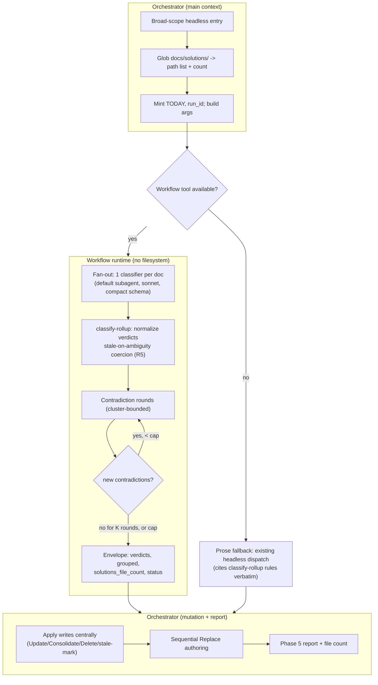
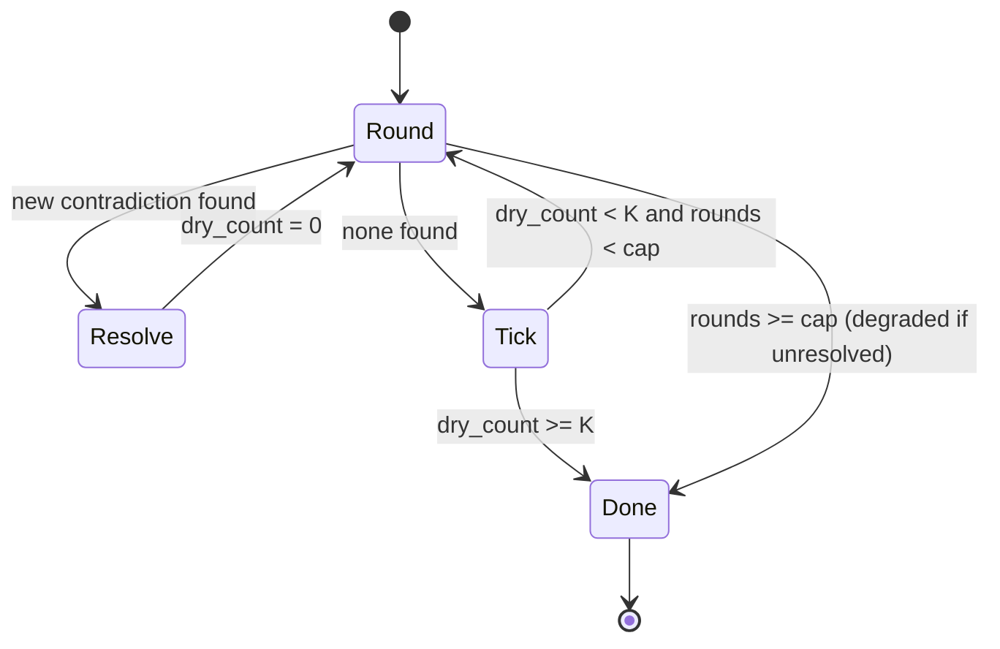

# feat: ce-compound-refresh corpus-audit dynamic workflow

## Summary

Convert `ce-compound-refresh`'s broad-scope headless classification pass into a Claude Code dynamic workflow (candidate **B1 / corpus-audit** in the opportunity map). The workflow fans out one read-only classifier per `docs/solutions/` learning, rolls the verdicts up deterministically — coercing every ambiguous case to `stale` rather than acting destructively — runs a bounded loop-until-dry cross-doc contradiction pass, and returns a compact report envelope plus the `docs/solutions/` file count. The orchestrator then applies file mutations centrally and surfaces the report. Interactive and focused/batch scopes keep their existing prose path; a Workflow-availability guard preserves a working prose fallback on non-CC targets.

## Problem Frame

`ce-compound-refresh` already has a headless mode and a subagent fan-out strategy, but at broad scope (9+ docs) every investigation subagent's evidence flows back through the orchestrator's context before classification — the exact context-fracture the opportunity map targets. The corpus is now **46** learnings (measured 2026-06-13; the map's "31" is stale) and grows with every `ce-compound` run; the B2 retrieval timing trigger fires at ≥150. Corpus-wide maintenance is neither codified as a script nor offloaded from the main conversation, and the cross-doc contradiction check (Phase 1.75) is the highest-value, most fan-out-heavy part of the skill.

Per opportunity map §5.3 and §6 Track B, B1's marginal gain over the existing headless baseline is: (a) the per-doc classification evidence never reaches the orchestrator context, (b) corpus-wide loop-until-dry contradiction resolution instead of selective-narrow, and (c) emitting the `docs/solutions/` file count that arms the B2 trigger. The hard constraint is the skill's existing safety invariant — mark ambiguous entries stale, never destructively archive/replace/merge on ambiguity (`ce-compound-refresh/SKILL.md:25`).

---

## Requirements

### Workflow behavior

- R1. In headless broad scope, when the Workflow tool is available, classification runs as a dynamic workflow that returns only a final envelope; the per-doc evidence stays in the workflow runtime.
- R2. The workflow fans out one read-only classifier per in-scope learning, returning a per-doc verdict (Keep / Update / Consolidate / Replace / Delete / stale) against a compact schema.
- R3. The cross-doc contradiction pass runs in rounds until K consecutive rounds surface no new contradiction or a hard iteration cap is reached, whichever first.
- R4. The envelope carries `solutions_file_count` (the count of in-scope `docs/solutions/` files), surfaced in the Phase 5 report.

### Safety and determinism

- R5. Any verdict whose classification is ambiguous, or whose Replace evidence is insufficient, is coerced to `stale` — the workflow never emits a destructive verdict (Delete / Replace / Consolidate) on ambiguity.
- R6. A failed or null classifier, or a failed contradiction round, yields a `degraded` status and is never read as "Keep" or "no contradictions."
- R7. Verdicts and grouped projections are produced by the canonical module on a deterministic total key; the orchestrator copies grouped projections verbatim and never re-derives groups from the flat list.

### Parity and portability

- R8. The deterministic classification/rollup logic (including the R5 stale-on-ambiguity rule and the R3 termination predicate) lives in one canonical pure module, inlined into the workflow at build time and pinned by a freshness test.
- R9. The prose fallback cites the canonical module's rules verbatim and remains a fully-functional headless refresh on targets without the Workflow tool (R15 of the opportunity map).
- R10. The workflow is side-effect-free: it classifies and recommends; the orchestrator performs all file writes (Update / Consolidate / Delete / stale-mark) and sequential Replace authoring centrally after the envelope returns.

---

## Key Technical Decisions

- KTD1 — Guard fires in headless broad scope only. Mirror `ce-doc-review`'s `mode:headless`-only guard: interactive, focused, and batch scopes always run the prose dispatch (their value is the interactive ambiguity gate, which cannot convert). The fan-out payoff is concentrated at broad scope (9+ docs). (Pattern: `ce-doc-review/SKILL.md` headless guard.)

- KTD2 — Workflow classifies; orchestrator mutates. The workflow dispatches only read-only investigation/classify agents and returns verdicts + grouped projections. The orchestrator applies all writes centrally after the envelope returns, and Replace-successor authoring stays sequential and orchestrator-side (the existing "replacement subagents run one at a time" rule, `ce-compound-refresh/SKILL.md:292`). Rationale: keeps the workflow side-effect-free and safe to retry, confines mutation to one place, and respects the sequential-replacement rule. (R10.)

- KTD3 — Pass path lists, not file contents, in `args`. The orchestrator globs `docs/solutions/` and passes the path list (and its length) in `args`. Both the classifier agents and the later contradiction-round agents receive only **paths** and Read their own docs (agents have file tools; the workflow runtime does not); the canonical module only ever touches agent-returned structured data, so no raw-file parsing happens in the workflow script — sidestepping the large-`args` payload that passing 46+ file contents would create. Contrast with `ce-verify-work`, which passes `plan_text` because its module parses the plan pre-fan-out; B1's unit enumeration is a glob result, so paths suffice. (Live-boundary contract 4 nuance + `pass-paths-not-content-to-subagents.md`.)

- KTD4 — The stale-on-ambiguity invariant lives in the module, stated once. `classify-rollup.js` coerces any ambiguous or insufficient-evidence verdict to `stale` and rejects destructive verdicts on ambiguity. The workflow path inlines it; the prose fallback cites it verbatim. The invariant is never restated as independent prose that could drift. (R5, R8; `workflow-fallback-parity-via-canonical-module.md`.)

- KTD5 — Loop-until-dry with a bounded cap and fail-closed rounds. The contradiction pass terminates at K consecutive "dry" rounds (no new contradiction) or a hard iteration cap. A degraded/failed round never counts as dry. K and the cap are tunable constants resolved at the live smoke (default K=2, cap=5). No existing learning covers loop-until-dry termination design — capture after landing. (R3, R6.)

- KTD6 — Contradiction comparison is cluster-bounded, not all-pairs, with the cluster key carried in the classifier return. To cluster without the workflow script reading any file, each classifier returns its doc's `module` / `tags` / `problem_type` (read from frontmatter by the agent) plus a short evidence summary in the compact schema, and `classify-rollup.js`'s `buildClusters` forms the cluster map from the returned verdicts. Each contradiction round then dispatches one agent per cluster, passing that cluster's doc **paths** (in workflow scope from `args`); the agent Reads the docs it compares. So rounds compare within clusters, not across the full N² corpus, and no document content is ever passed to the workflow script (honoring live-boundary contract 4). Contradiction rounds stay inside the workflow rather than orchestrator-side because the classifier verdict + cluster state they consume is already in workflow scope, avoiding a per-round round-trip. (`compound-refresh-skill-improvements.md` evidence-clustering.)

- KTD7 — Default workflow subagent for classifiers, `model: sonnet`. Classification is rubric-driven (the five-action taxonomy + concepts of staleness), not a specialized persona, so dispatch the default workflow subagent (omit `agentType`) with the classify prompt + compact schema. No new `ce-*` agent is introduced. If any `agentType` is used, it must be the plugin-namespaced `compound-engineering:ce-*` form. (Live-boundary contract 2.)

- KTD8 — Compact inline schema; richer contracts in the module. The inline `agent()` schema stays `type`/`required`/`enum`/`items` only — no `allOf`/`if`/`then`. Evidence-sufficiency and cross-field rules are enforced deterministically in `classify-rollup.js`, dropping and logging non-conforming entries. (Live-boundary contract 5.)

- KTD9 — Report-only output by default; no committed telemetry artifact. The printed Phase 5 report plus the in-place file mutations are the deliverable, matching today's headless behavior. If a durable per-run audit-event record is added later, it lands in its own top-level directory outside `docs/solutions/` (never inside), so future refresh runs and `ce-learnings-researcher` do not treat audit telemetry as a learning. (`machine-telemetry-outside-human-learnings-corpus.md`.)

---

## High-Level Technical Design

Three-actor flow — orchestrator (main context) → workflow runtime → orchestrator again for mutation:

Loop-until-dry termination (the contradiction state machine):

---

## Implementation Units

### U1. Canonical pure module `classify-rollup.js`

- Goal: The single source of truth for verdict normalization, the stale-on-ambiguity coercion, the loop-until-dry termination predicate, deterministic sort, grouped projection, and file-count passthrough.
- Requirements: R5, R6, R7, R8, R3.
- Dependencies: none.
- Files: `plugins/compound-engineering/skills/ce-compound-refresh/workflows/classify-rollup.js`, `tests/compound-refresh-rollup.test.ts`.
- Approach: Pure functions, no Workflow/Agent/filesystem dependencies, importable by `bun test` and inlineable. Export a single trailing `export { ... };` line (the only thing the build step strips). Functions roughly: `normalizeVerdict(raw)`, `rollupClassifications(verdicts)` (applies stale-on-ambiguity below a named confidence threshold, fail-closed degraded handling, deterministic sort, grouped projection), `buildClusters(verdicts)` (groups by the returned `module`/`tags`/`problem_type`), `contradictionTermination(state)` (the K-dry / cap predicate). State the ambiguity confidence threshold as a named module constant, and carry the termination logic as an explicit decision table (input state → `dry_count` update → output action → status) in a module comment, so the prose fallback cites the constant and the table verbatim rather than re-narrating the state machine (R9 parity). Mirror `drift-rollup.js` and `merge-findings.js` shape.
- Patterns to follow: `plugins/compound-engineering/skills/ce-verify-work/workflows/drift-rollup.js`; `plugins/compound-engineering/skills/ce-code-review/workflows/merge-findings.js`.
- Execution note: Test-first — this module is the safety-critical core; write failing tests for the stale-on-ambiguity and termination rules before the implementation.
- Test scenarios:
  - Covers R5. An ambiguous verdict (low confidence, or Update-vs-Replace conflict signaled) is coerced to `stale`, not the raw destructive value.
  - Covers R5. A Replace verdict with explicit insufficient-evidence flag is coerced to `stale`; a Replace with sufficient evidence is preserved.
  - A destructive verdict (Delete) with unambiguous auto-delete signals (implementation gone + domain gone + no inbound links) is preserved.
  - Covers R6. A null/failed classifier entry is recorded as `unverifiable`/degraded, never `Keep`.
  - Covers R3. Termination returns "continue" while dry rounds < K; "done" at K consecutive dry rounds; "done (degraded)" at the hard cap with unresolved contradictions; a failed round resets/never increments the dry counter.
  - Covers R7. Deterministic sort orders verdicts on the filename total key including a boundary where input order is scrambled; the grouped projection's membership equals the corresponding filter over the sorted flat list.
  - `buildClusters` groups verdicts sharing `module`/`tags`/`problem_type` and isolates singletons, deterministically across scrambled input.
  - Ambiguity coercion uses the named confidence threshold: a verdict at/above it keeps its class; just below it coerces to `stale`.
  - Empty corpus → clean empty envelope (`solutions_file_count: 0`, no verdicts, status complete).

### U2. Fan-out template `corpus-audit-fanout.js`

- Goal: The workflow template that parses `args`, fans out classifiers, runs the contradiction rounds, and returns the envelope — with the module functions undefined until build-time assembly.
- Requirements: R1, R2, R3, R4, R6, KTD3, KTD7, KTD8.
- Dependencies: U1.
- Files: `plugins/compound-engineering/skills/ce-compound-refresh/workflows/corpus-audit-fanout.js`.
- Approach: `export const meta` first; `/* __MERGE_MODULE__ */` marker after meta; defensive `args` JSON-string parse; read `paths`, `solutions_file_count`, `run_id`, `today`, `scope_hint` from args. Compact classify schema (`type`/`required`/`enum`/`items` only) returning `verdict` + classification fields **plus** the doc's `module`/`tags`/`problem_type` and a short `evidence` summary (so `buildClusters` can form the cluster map and contradiction agents have a starting signal). Parallel classifier dispatch (default subagent, `model: sonnet`), `.catch` that `log`s dispatch failures and returns null. Then `buildClusters`; each contradiction round dispatches one agent per cluster, passing that cluster's doc **paths** (the agent Reads the docs it compares), driven by `contradictionTermination`. Return `{ status, solutions_file_count, verdicts, grouped, contradictions, counts, artifact_path, run_id }`.
- Patterns to follow: `plugins/compound-engineering/skills/ce-code-review/workflows/code-review-fanout.js` (args parse, COMPACT_SCHEMA, parallel `.then/.catch` with `log`, envelope shape).
- Test scenarios: Test expectation: none directly — the template is not independently runnable (module undefined until assembly); behavior is covered by U4 parity (static) and U6 (live).

### U3. Build script `scripts/build-compound-refresh-workflow.ts`

- Goal: Assemble template + module into the committed `.generated.js`.
- Requirements: R8.
- Dependencies: U1, U2.
- Files: `scripts/build-compound-refresh-workflow.ts`, `plugins/compound-engineering/skills/ce-compound-refresh/workflows/corpus-audit-fanout.generated.js`.
- Approach: Export `assembleCorpusAuditWorkflow(root)`; read both sources, strip the module's trailing `export { ... };` (throw if absent), assert the marker appears exactly once, replace via a function replacement (keeps `$` literal), prepend the GENERATED header, write the artifact. Invoke as `bun run scripts/build-compound-refresh-workflow.ts` (matching the sibling `build-*-workflow.ts` convention; no `package.json` alias needed). The build asserts only structural invariants over the U1/U2 sources (marker present, export strippable); U2's runtime behavior is proven downstream by U4 (the assembled artifact) and U6 (live), not independently — so this unit depends only on the U1/U2 sources existing.
- Patterns to follow: `scripts/build-review-workflow.ts` (near-verbatim structure).
- Test scenarios: Covered by U4 (the freshness assertion exercises `assembleCorpusAuditWorkflow`).

### U4. Parity + freshness test `tests/compound-refresh-workflow-parity.test.ts`

- Goal: Pin every statically-checkable contract for the workflow.
- Requirements: R8, R9.
- Dependencies: U2, U3.
- Files: `tests/compound-refresh-workflow-parity.test.ts`.
- Approach: Mirror `tests/review-workflow-parity.test.ts` and `tests/work-vs-plan-workflow-parity.test.ts`.
- Test scenarios:
  - Marker appears exactly once in the template; module has a strippable trailing export.
  - Committed `.generated.js` is byte-identical to a fresh assembly (freshness gate).
  - `export const meta` is the first non-comment, non-blank statement; `meta` is a pure literal.
  - Generated script wrapped in `new Function(...)` does not throw (syntax validity).
  - Inlined named functions from `classify-rollup.js` appear in the generated file.
  - Live-boundary regression guards present at source level: the `args`-as-JSON-string parse, dispatch failures `log`ged (no silent `.catch(() => null)`), any `agentType` is `compound-engineering:`-namespaced, the inline schema contains no `allOf`/`if`/`then`.
  - Cross-platform: guard + fallback text survive the Codex and OpenCode content transforms; the co-located `.generated.js` path is preserved; the isolated skill-dir copy carries the `workflows/` subdir.
  - Prose-parity guard: the K-dry and iteration-cap constants and the termination decision-table identifiers appear in the SKILL.md prose-fallback section, matching the module's exported constants — so the loop-until-dry fallback cannot silently diverge from the module's branching.

### U5. SKILL.md availability guard + prose-fallback sync + count surfacing

- Goal: Wire the workflow behind the broad-scope headless path with a verbatim-cited prose fallback, and surface the file count in the report.
- Requirements: R1, R4, R9, R10.
- Dependencies: U3.
- Files: `plugins/compound-engineering/skills/ce-compound-refresh/SKILL.md`.
- Approach: Add a "Workflow acceleration (broad-scope headless only)" subsection to the Broad Scope / Subagent Strategy area: when the Workflow tool is available, read `workflows/corpus-audit-fanout.generated.js`, invoke the Workflow tool with `args` = `{ paths, solutions_file_count, run_id, today, scope_hint }`, consume the returned envelope, then apply writes centrally (KTD2) and copy `envelope.grouped` verbatim (R7). State the cross-platform guard explicitly. The prose fallback names `classify-rollup.js` and restates its rules verbatim — the named ambiguity-confidence threshold, fail-closed degraded handling, the termination decision table (input state → `dry_count` → action → status), and the sort. Extend the Phase 5 / Output Format report to print the `solutions_file_count` — the in-scope corpus size measured at glob time (pre-mutation), which is the value that arms B2's trigger; deletes/consolidations during this run may change the on-disk count afterward. Mint `today` and `run_id` in the orchestrator (Date.now() is unavailable in the runtime — live-boundary contract 6), even though B1 itself writes no dated artifact, so the args contract matches the established pattern.
- Patterns to follow: `ce-code-review/SKILL.md:353-364` (guard); `ce-verify-work/SKILL.md` ("do not improvise the math" verbatim-citation).
- Test scenarios: Test expectation: none (prose); the transform-survival of the guard/fallback text is asserted in U4.

### U6. Live smoke gate (the live boundary)

- Goal: Prove the live-boundary contracts that no static test reaches.
- Requirements: R1, R2, R3, R5, R6, R4.
- Dependencies: U5.
- Files: `tests/compound-refresh-workflow-eval.test.ts` documents the gate; the live `Workflow` dispatch is the mandatory acceptance step (not optional — see the execution note).
- Approach: Run the real Workflow against a small fixture subset of `docs/solutions/` containing a planted ambiguous doc and a planted cross-doc contradiction, N≥3 trials.
- Execution note: Mandatory acceptance gate; not assertable in `bun test`.
- Test scenarios:
  - Envelope `status: complete`, non-zero `subagent_tokens`, verdicts populated (not an empty silent run).
  - Covers R5. The planted ambiguous doc returns `stale`, never a destructive verdict.
  - Covers R3. The planted contradiction surfaces and the loop terminates within the cap.
  - Covers R4. `solutions_file_count` equals the actual in-scope count.
  - Across the N trials, verdict classes are stable for the unambiguous planted docs.

---

## Risks & Dependencies

- Risk — silent empty/degraded output that passes every static test (the entire live-boundary failure class). Mitigation: U6 with planted fixtures; the U4 source-level regression guards.
- Risk — destructive action on ambiguity. Mitigation: KTD4 invariant in the module, U1 tests, the U6 planted-ambiguous assertion.
- Risk — contradiction comparison blow-up at corpus scale. Mitigation: KTD6 cluster-bounded rounds.
- Risk — large fan-out cost (one sonnet classifier per doc; 46 today, growing). Acceptable for a maintenance sweep; the workflow concurrency cap queues excess. Note the cost in the report.
- Risk — parity drift between the workflow path and the prose fallback. Mitigation: U4 freshness test + R9 verbatim citation.
- Dependency — none external. Shares `plugins/compound-engineering/skills/ce-compound-refresh/SKILL.md` with the companion C0 plan (`docs/plans/2026-06-13-002-feat-concepts-rebuild-workflow-plan.md`) — a parallel Track C conversion, not a downstream phase of B1. Land the two sequentially rather than on parallel branches to avoid a SKILL.md merge conflict (distinct sections — B1 edits the broad-scope headless path, C0 the bootstrap path — but the same file); either order works, pick one and land it first.

---

## Open Questions

- Loop-until-dry constants: exact K (consecutive dry rounds) and hard iteration cap. Default K=2, cap=5; confirm at the U6 live smoke.
- Contradiction clustering key (`module` vs `tags` vs `problem_type`): reuse the existing Phase 1.75 clustering; tune at implementation.
- Whether pattern docs (`docs/solutions/patterns/`) are classified in the same fan-out or a second pass. Default: same fan-out, after learnings (preserves the existing refresh order).
- Whether to persist a durable per-run audit-event artifact (deferred; KTD9 — report-only default; outside `docs/solutions/` if ever added).

---

## Scope Boundaries

### Deferred to Follow-Up Work

- Capturing the new learnings this conversion will produce (loop-until-dry termination design; the corpus-audit fan-out pattern) via `ce-compound` after landing — the live-boundary corpus notes that neither is documented yet.
- Any durable audit-event telemetry directory (KTD9).

### Outside this plan

- Interactive, focused, and batch refresh paths — they keep the prose dispatch unchanged (KTD1).
- Replace-successor authoring parallelization — stays sequential and orchestrator-side (KTD2).

---

## Sources / Research

- Opportunity map rows and sequencing: `docs/dynamic-workflows-opportunity-map.md` §5.3 (corpus-audit), §6 Track B, §7 R14/R15. Upstream requirements: `docs/brainstorms/2026-06-04-dynamic-workflows-opportunity-map-requirements.md`.
- Live-boundary runtime contracts (args parse, namespaced `agentType`, log dispatch failures, no filesystem, minimal schema, no `Date.now()`, N≥3 live smoke): `docs/solutions/skill-design/dynamic-workflow-conversion-live-boundary.md`.
- Build-time parity pattern (pure module → marker → build script → freshness test → verbatim fallback): `docs/solutions/architecture-patterns/workflow-fallback-parity-via-canonical-module.md`.
- Prior `ce-compound-refresh` redesign pain points (cross-phase rule contradictions, evidence-before-scope, conservative-confidence stale-marking, no-shell-in-subagents): `docs/solutions/skill-design/compound-refresh-skill-improvements.md`.
- Determinism + projection safety: `docs/solutions/skill-design/deterministic-sort-before-committing-model-output.md`, `docs/solutions/skill-design/verbatim-copy-grouped-projection-from-script.md`.
- Fail-closed posture and capture-gate selection bias: `docs/solutions/skill-design/validation-gate-fail-closed-posture.md`, `docs/solutions/skill-design/capture-gate-avoid-selection-bias.md`.
- Telemetry separation: `docs/solutions/skill-design/machine-telemetry-outside-human-learnings-corpus.md`.
- Template references: `plugins/compound-engineering/skills/ce-code-review/workflows/code-review-fanout.js` + `merge-findings.js` + `scripts/build-review-workflow.ts`; `plugins/compound-engineering/skills/ce-verify-work/workflows/` (`work-vs-plan-fanout.js` + `drift-rollup.js`).
- Skill source: `plugins/compound-engineering/skills/ce-compound-refresh/SKILL.md` (headless rules, five-action taxonomy, Phase 1.75, Subagent Strategy, safety invariant at line 25).
