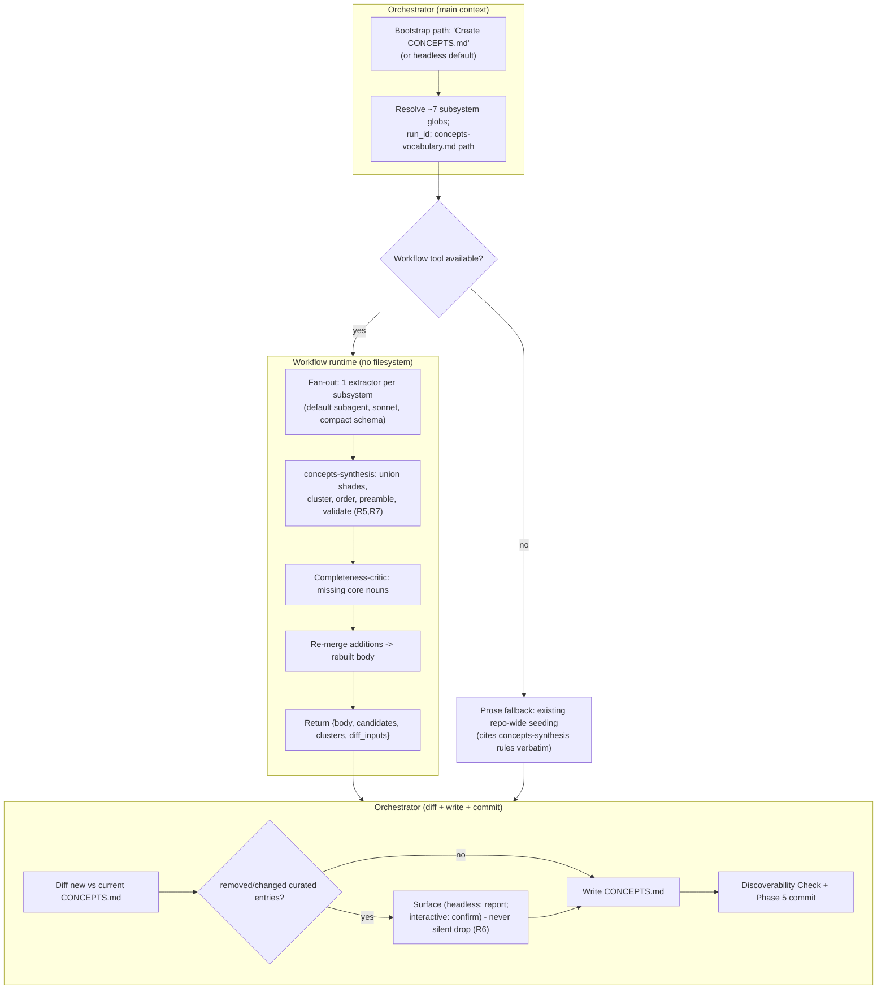

# feat: CONCEPTS.md rebuild dynamic workflow in ce-compound-refresh

## Summary

Convert `ce-compound-refresh`'s existing repo-wide `CONCEPTS.md` bootstrap path into a Claude Code dynamic workflow (candidate **C0 / codebase-map refresh** in the opportunity map). The workflow fans out one extractor per repo subsystem (~7), synthesizes a clustered glossary deterministically, runs a completeness-critic pass for core nouns that friction-driven accretion never surfaced, and returns the rebuilt `CONCEPTS.md` body. The orchestrator diffs the result against the current file, surfaces any removed curated entries (never silently dropping them), writes, runs the discoverability check, and commits. A Workflow-availability guard preserves the existing prose seeding as the fallback. Lives in `ce-compound-refresh` per the home decision — no new skill.

## Problem Frame

`CONCEPTS.md` is built incrementally and reactively: `ce-compound` Phase 2.4 seeds per-learning, `ce-compound-refresh` Phase 4.5 reconciles per-scope. There is no comprehensive rebuild, so core domain nouns that no learning happened to touch never enter the glossary — the gap the opportunity map (§5.4) calls out: "completeness-critic pass catches core nouns that friction-driven accretion never surfaces." `ce-compound-refresh` already owns a repo-wide bootstrap path ("Create CONCEPTS.md (build the concept map)", `SKILL.md:33`), but it runs as orchestrator prose with no fan-out. C0's entire value is the increment from manual/incremental to a scheduled comprehensive rebuild; the fan-out over subsystems is the natural workflow shape, and the completeness-critic is the rigor layer prose orchestration cannot cheaply add.

---

## Requirements

### Workflow behavior

- R1. Behind the repo-wide `CONCEPTS.md` bootstrap path, when the Workflow tool is available, the rebuild runs as a dynamic workflow returning only the rebuilt body; per-subsystem extraction stays in the workflow runtime.
- R2. The workflow fans out one extractor agent per repo subsystem (~7), each returning candidate domain terms (name + one-line definition + cluster hint) against a compact schema, judged against the `concepts-vocabulary.md` qualifying bar.
- R3. A completeness-critic pass identifies core nouns missing from the synthesized set, given the declared domain model; its additions re-enter synthesis for a final merge.
- R4. The workflow returns the rebuilt `CONCEPTS.md` body (markdown), including the canonical preamble; it writes no file.

### Synthesis quality and safety

- R5. Candidate terms surfacing from multiple subsystems are unioned into one entry (shades merged), never duplicated and never most-recent-wins.
- R6. The rebuild never silently removes an existing qualifying entry: the orchestrator diffs new vs current `CONCEPTS.md` and surfaces removed/changed entries (headless: reported as recommendations; interactive: confirmed) before writing.
- R7. Synthesized entries respect glossary-only discipline — no file paths, class names, function signatures, or current-config values; entries are clustered by domain relationship with deterministic ordering.

### Parity and portability

- R8. The deterministic synthesis logic (dedup/union, clustering, ordering, preamble injection, structural validation, and the new-vs-current diff) lives in one canonical pure module, inlined at build time and pinned by a freshness test.
- R9. The prose fallback cites the module's rules verbatim and remains the fully-functional repo-wide seeding path on targets without the Workflow tool (R15 of the opportunity map).
- R10. The conversion reuses the existing `ce-compound-refresh/references/concepts-vocabulary.md` copy — it adds no third copy and no new skill.

---

## Key Technical Decisions

- KTD1 — Extend `ce-compound-refresh`, not a new skill (home decision). The workflow lives at `skills/ce-compound-refresh/workflows/`, wired behind the existing bootstrap path's "Create CONCEPTS.md" option (`SKILL.md:33`). Reuses `references/concepts-vocabulary.md`; no README/plugin.json count change, no third vocabulary copy. (R10.)

- KTD2 — Fan out one extractor per subsystem; pass globs, not contents. The orchestrator resolves ~7 subsystem path globs (agents, skills, output-contract schemas, instruction files, plugin/marketplace metadata, core docs, fixtures/tests) and passes them in `args`; each extractor agent Reads its own subsystem files and the `concepts-vocabulary.md` qualifying-bar rules (passed by path), returning candidate terms against a compact schema. The workflow script reads no files itself. (`pass-paths-not-content-to-subagents.md`; live-boundary contract 4.)

- KTD3 — Synthesis is deterministic in the module; the critic is LLM judgment. `concepts-synthesis.js` owns dedup/union-of-shades, clustering, deterministic ordering, preamble injection, structural validation (reject path/class/config entries), and the new-vs-current diff. The completeness-critic is a dispatched judgment agent (no numeric score), so the parity anchor is the module's deterministic operations; the critic's qualifying criteria are documented verbatim in the prose fallback. (R5, R7, R8.)

- KTD4 — Workflow computes the diff and returns body + diff; orchestrator writes and commits. The workflow is side-effect-free (the runtime has no filesystem): it receives `current_concepts_text` in `args`, runs `diffConcepts` internally against the synthesized body, and returns `{ body, candidates, clusters, diff: { added, removed, changed }, status }`. The orchestrator surfaces removals (R6), writes `CONCEPTS.md`, runs the Discoverability Check, and commits via the existing Phase 5 flow. A text-blob diff (not `git diff`) is required because the comparison happens pre-write and inside the workflow runtime, which has neither filesystem nor git. (R4, R6.)

- KTD5 — No-silent-removal is the C0 safety invariant (analogous to B1's stale-on-ambiguity). The preamble explicitly permits direct human edits, so the comprehensive rebuild must not nuke curated vocabulary. The module's diff classifies entries added / removed / changed; removed entries are surfaced, and in headless mode are reported as recommendations rather than dropped. (R6.)

- KTD6 — Live-boundary contracts apply, with contracts 2 and 6 N/A. Defensive `args` JSON-string parse; default workflow subagent (omit `agentType`) for extractors and the critic, `model: sonnet`; `log` dispatch failures; minimal inline schema (no `allOf`/`if`/`then`). Because `agentType` is omitted, the plugin-namespacing contract (2) does not apply — but if any `agentType` is later introduced it must be the `compound-engineering:ce-*` form. `CONCEPTS.md` carries no date field, so the no-`Date.now()` timestamp contract (6) does not apply either. (Live-boundary contracts 1, 3, 5.)

- KTD7 — Bounded, fixed fan-out. Unlike B1's unbounded corpus, C0 fans out over a fixed ~7 subsystems, so concurrency and cost are bounded. The subsystem list is maintained in SKILL.md; the completeness-critic partially compensates for a subsystem added later but not yet listed.

---

## High-Level Technical Design

---

## Implementation Units

### U1. Canonical pure module `concepts-synthesis.js`

- Goal: Single source of truth for dedup/union, clustering, ordering, preamble injection, glossary-only structural validation, and the new-vs-current diff.
- Requirements: R5, R7, R8, R6.
- Dependencies: none.
- Files: `plugins/compound-engineering/skills/ce-compound-refresh/workflows/concepts-synthesis.js`, `tests/concepts-synthesis.test.ts`.
- Approach: Pure functions, importable by `bun test` and inlineable, single trailing `export { ... };`. Functions roughly: `dedupeTerms(candidates)` (union shades), `clusterAndOrder(terms)` (deterministic), `injectPreamble(body)`, `validateGlossaryDiscipline(entry)` (reject file paths/class names/config values), `diffConcepts(currentText, newText)` → `{ added, removed, changed }`. `diffConcepts` treats null/empty `currentText` as "no prior file" — every term is `added`, nothing is `removed` (the bootstrap-create case, which is the primary path per KTD1). Mirror `drift-rollup.js`/`merge-findings.js` shape.
- Patterns to follow: `plugins/compound-engineering/skills/ce-verify-work/workflows/drift-rollup.js`; the Phase 4.5 union-of-shades rule in `ce-compound-refresh/SKILL.md:507` and `references/concepts-vocabulary.md`.
- Execution note: Test-first — the no-silent-removal diff (R6) and union-of-shades (R5) are the safety-critical operations.
- Test scenarios:
  - Covers R5. The same term surfacing from two subsystems with different shades produces one unioned entry, not two and not most-recent-wins.
  - Covers R7. An entry containing a file path / class name / threshold value is rejected or flagged by `validateGlossaryDiscipline`.
  - Covers R7. Clustering and ordering are deterministic across scrambled input.
  - The canonical preamble is present exactly once at the top of the rebuilt body.
  - Covers R6. `diffConcepts` detects a curated entry present in current but absent in new as `removed`; a definition change as `changed`; a genuinely new term as `added`.
  - Empty candidate set → clean empty body with preamble only, status reflecting no terms.

### U2. Fan-out template `concepts-rebuild-fanout.js`

- Goal: The workflow template — parse `args`, fan out extractors, run the critic, synthesize, return the body.
- Requirements: R1, R2, R3, R4, R6, KTD2.
- Dependencies: U1.
- Files: `plugins/compound-engineering/skills/ce-compound-refresh/workflows/concepts-rebuild-fanout.js`.
- Approach: `export const meta` first; `/* __MERGE_MODULE__ */` marker after meta; defensive `args` parse reading `subsystems` (`[{ name, globs }]`), `vocab_rules_path`, `current_concepts_text` (empty string when `CONCEPTS.md` is absent — the bootstrap-create case), `run_id`. Compact term schema. Parallel extractor dispatch (default subagent, sonnet, `.catch` + `log`). Completeness-critic dispatch receiving the synthesized term names + `vocab_rules_path` + the subsystem globs, so it can cross-check declared domain entities against the glossary (not merely judge plausibility). Calls `concepts-synthesis` functions, including `diffConcepts(current_concepts_text, body)` run internally. Return `{ status, body, candidates, clusters, diff: { added, removed, changed }, run_id }`.
- Patterns to follow: `plugins/compound-engineering/skills/ce-code-review/workflows/code-review-fanout.js`.
- Test scenarios: Test expectation: none directly — template not independently runnable; covered by U4 (static) and U6 (live).

### U3. Build script `scripts/build-concepts-workflow.ts`

- Goal: Assemble template + module into the committed `.generated.js`.
- Requirements: R8.
- Dependencies: U1, U2.
- Files: `scripts/build-concepts-workflow.ts`, `plugins/compound-engineering/skills/ce-compound-refresh/workflows/concepts-rebuild-fanout.generated.js`.
- Approach: Export `assembleConceptsWorkflow(root)`; same strip-trailing-export, assert-single-marker, replace, prepend-header, write structure as `build-review-workflow.ts`. Invoke as `bun run scripts/build-concepts-workflow.ts` (matching the sibling `build-*-workflow.ts` convention; no `package.json` alias needed).
- Patterns to follow: `scripts/build-review-workflow.ts`.
- Test scenarios: Covered by U4.

### U4. Parity + freshness test `tests/concepts-workflow-parity.test.ts`

- Goal: Pin every statically-checkable workflow contract.
- Requirements: R8, R9.
- Dependencies: U2, U3.
- Files: `tests/concepts-workflow-parity.test.ts`.
- Approach: Mirror `tests/review-workflow-parity.test.ts`.
- Test scenarios:
  - Marker appears exactly once; module has a strippable trailing export.
  - Committed `.generated.js` is byte-identical to fresh assembly (freshness gate).
  - `export const meta` first; `meta` is a pure literal.
  - Generated script wrapped in `new Function(...)` does not throw.
  - Inlined `concepts-synthesis.js` functions appear in the generated file.
  - Live-boundary source guards: `args` JSON-string parse present, dispatch failures `log`ged, any `agentType` namespaced, inline schema free of `allOf`/`if`/`then`.
  - Cross-platform: guard + fallback survive Codex/OpenCode transforms; co-located generated path preserved; `workflows/` carried in the isolated skill-dir copy.
  - Prose-sync guard: each canonical `concepts-synthesis.js` function name (`dedupeTerms`, `clusterAndOrder`, `validateGlossaryDiscipline`, `diffConcepts`) appears in the SKILL.md prose-fallback section — catches a rename or rule addition the fallback no longer reflects.
  - Subsystem-glob resolution: every glob in the SKILL.md subsystem list matches at least one real path in the repo (turns "maintained in SKILL.md" into a verified constraint).

### U5. SKILL.md guard + prose-fallback sync in the bootstrap path

- Goal: Wire the workflow behind the "Create CONCEPTS.md" bootstrap option with a verbatim-cited prose fallback, and the orchestrator-side diff/write/commit.
- Requirements: R1, R4, R6, R9, R10.
- Dependencies: U3.
- Files: `plugins/compound-engineering/skills/ce-compound-refresh/SKILL.md`.
- Approach: In the "CONCEPTS.md bootstrap requests" section (option 1) and the headless default, add a "Workflow acceleration (repo-wide rebuild)" subsection: when the Workflow tool is available, read `workflows/concepts-rebuild-fanout.generated.js`, invoke with `args` = `{ subsystems, vocab_rules_path, current_concepts_text, run_id }`, then diff via `concepts-synthesis` orchestrator-side, surface removals (R6), write `CONCEPTS.md`, run the Discoverability Check, commit via Phase 5. State the cross-platform guard. The prose fallback names `concepts-synthesis.js` and restates its rules verbatim (union-of-shades, clustering/order, glossary-only validation, no-silent-removal diff) plus the completeness-critic criteria. Maintain the ~7-subsystem list here. The prose-sync and subsystem-glob-resolution guards live in U4.
- Patterns to follow: `ce-code-review/SKILL.md:353-364` (guard); `ce-verify-work/SKILL.md` verbatim-citation; existing Phase 4.5 / bootstrap prose.
- Test scenarios: Test expectation: none (prose); transform survival asserted in U4.

### U6. Live smoke gate (the live boundary)

- Goal: Prove the live-boundary contracts and the no-silent-removal safety end to end.
- Requirements: R1, R2, R3, R4, R6.
- Dependencies: U5.
- Files: `tests/concepts-workflow-eval.test.ts` documents the gate; the live `Workflow` dispatch is the mandatory acceptance step (not optional — see the execution note).
- Approach: Run the real Workflow over the actual repo subsystems, N≥3 trials, against the current `CONCEPTS.md`; include one trial against a repo state with no `CONCEPTS.md` (the bootstrap-create path).
- Execution note: Mandatory acceptance gate; not assertable in `bun test`.
- Test scenarios:
  - Envelope `status: complete`, non-zero `subagent_tokens`, each subsystem produced candidates (no silent empty run).
  - The rebuilt body contains the canonical preamble and is non-empty.
  - Covers R3. The completeness-critic fired (its additions are traceable), not silently skipped.
  - Covers R6. The diff against current `CONCEPTS.md` surfaces no silently removed curated entry — every removal is reported.
  - Covers the bootstrap case. A trial with no existing `CONCEPTS.md` completes with every term `added` and no false-positive removal.
  - Across N trials, at least 75% of unique core-noun terms appear in all N trials (ranged, not exact — synthesis is model-mediated).

---

## Risks & Dependencies

- Risk — silently nuking curated vocabulary on rebuild. Mitigation: KTD5 no-silent-removal diff, U1 diff tests, U6 removal-surfacing assertion.
- Risk — silent empty/degraded output passing static tests (live-boundary class). Mitigation: U6 + U4 source guards.
- Risk — completeness-critic silently skipped → an incomplete map that looks complete. Mitigation: fail-closed; U6 asserts the critic fired.
- Risk — subsystem list drifts as the repo grows. Mitigation: maintained list in SKILL.md + a U4 static check that every listed glob resolves to a real path + critic partial backstop; revisit on major repo restructure.
- Risk — `concepts-vocabulary.md` exceeds the small-static-content threshold; passing its content inflates prompts. Mitigation: pass its path, agents Read it (KTD2).
- Dependency — shares `plugins/compound-engineering/skills/ce-compound-refresh/SKILL.md` with the B1 plan (`docs/plans/2026-06-13-001-feat-ce-compound-refresh-corpus-audit-workflow-plan.md`). Land sequentially to avoid a SKILL.md merge conflict (distinct sections — B1 edits the broad-scope headless path, C0 edits the bootstrap path).

---

## Open Questions

- Exact subsystem decomposition (the ~7): enumerate against current repo structure at implementation.
- Headless removal policy: default is report-removals-as-recommendations and do not delete curated entries (conservative, mirrors B1 stale-marking). Confirm at U6.
- Whether the rebuild should also fire inside the broad-scope refresh, or only via the explicit bootstrap path. Default: explicit bootstrap path only; Phase 4.5 stays incremental.

---

## Scope Boundaries

### Deferred to Follow-Up Work

- Capturing the new learning this conversion produces (the fanout-and-synthesize-with-completeness-critic pattern and its subsystem-coverage output schema) via `ce-compound` after landing — the live-boundary corpus notes it is undocumented.

### Outside this plan

- `ce-compound` Phase 2.4 per-learning seeding — unchanged.
- `ce-compound-refresh` Phase 4.5 per-scope reconciliation — stays prose/incremental (KTD7, Open Questions).
- The Discoverability Check and commit flow — reuse the existing Phase 5 path, orchestrator-side.

---

## Sources / Research

- Opportunity map row and sequencing: `docs/dynamic-workflows-opportunity-map.md` §5.4 (codebase-map refresh), §6 Track C, §7 R14/R15. Upstream requirements: `docs/brainstorms/2026-06-04-dynamic-workflows-opportunity-map-requirements.md`.
- Live-boundary runtime contracts: `docs/solutions/skill-design/dynamic-workflow-conversion-live-boundary.md`.
- Build-time parity pattern: `docs/solutions/architecture-patterns/workflow-fallback-parity-via-canonical-module.md`.
- Pass-paths-not-content (orchestrator→workflow vs workflow→agent boundary): `docs/solutions/skill-design/pass-paths-not-content-to-subagents.md`.
- Determinism + projection safety: `docs/solutions/skill-design/deterministic-sort-before-committing-model-output.md`, `docs/solutions/skill-design/verbatim-copy-grouped-projection-from-script.md`.
- Fail-closed posture: `docs/solutions/skill-design/validation-gate-fail-closed-posture.md`.
- CONCEPTS.md seeding rules and home: `plugins/compound-engineering/skills/ce-compound-refresh/SKILL.md` (Phase 4.5 lines 499-522, bootstrap path lines 29-36) and `plugins/compound-engineering/skills/ce-compound-refresh/references/concepts-vocabulary.md`; `plugins/compound-engineering/skills/ce-compound/SKILL.md` Phase 2.4 (per-learning seeding, unchanged). Duplication-sync rule for `concepts-vocabulary.md`: `plugins/compound-engineering/AGENTS.md`.
- Template references: `plugins/compound-engineering/skills/ce-code-review/workflows/code-review-fanout.js` + `scripts/build-review-workflow.ts`; `plugins/compound-engineering/skills/ce-verify-work/workflows/`.
